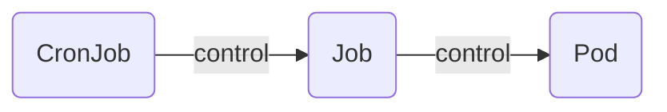

# Workloads API

workloads api provide control container.

## Pod

pod name is `RFC1123`

### create pod

single container pod

```yaml:sample-pod.yaml
apiVersion: v1
kind: Pod
metadata:
  name: sample-pod
spec:
  containers:
    - name: nginx-container
      image: nginx:1.16
```

```shell
sudo kubectl apply -f sample-pod.yaml
sudo kubectl get pods
sudo kubectl delete -f sample-pod.yaml
```

two containers pod

```yaml:sample2-pod.yaml
apiVersion: v1
kind: Pod
metadata:
  name: sample-pod
spec:
  containers:
    - name: nginx-container
      image: nginx:1.16
    - name: redis-container
      image: redis:3.2
```

```shell
sudo kubectl apply -f sample2-pod.yaml
sudo kubectl get pods
sudo kubectl delete -f sample2-pod.yaml
```

port duplication

```yaml:sample-fault-pod.yaml
apiVersion: v1
kind: Pod
metadata:
  name: sample-pod
spec:
  containers:
    - name: nginx-container1
      image: nginx:1.16
    - name: nginx-container2
      image: nginx:1.16
```

```shell
sudo kubectl apply -f sample2-pod.yaml
sudo kubectl get pods
sudo kubectl delete -f sample2-pod.yaml
```

### login and command execute

```yaml:sample-pod.yaml
apiVersion: v1
kind: Pod
metadata:
  name: sample-pod
spec:
  containers:
    - name: nginx-container
      image: nginx:1.16
```

```shell
sudo kubectl apply -f sample-pod
sudo kubectl exec -it sample-pod -- /bin/bash
```

container cconsole

```shell
apt update && apt -y install iproute2 procps
ip a | grep "inet"
ss -napt | grep -i listen
ps aux
exit
```

```shell
sudo kubectl exec -it sample-pod -- /bin/bash -c "ls | grep usr"
```

### command and args

| docker | k8s |
| :---- | :----- |
| ENTRYPOINT | command |
| CMD | args |

```yaml:sample-entrypoint.yaml
apiVersion: v1
kind: Pod
metadata:
  name: sample-entrypoint
spec:
  containers:
    - name: nginx-container-112
      image: nginx:1.16
      command: ["/bin/sleep"]
      args: ["60"]
```

```shell
sudo kubectl apply -f sample-entrypoint.yaml
sudo kubectl exec -it sample-entrypoint -- /bin/bash
```

container console

```shell
apt update && apt install -y procps
ps aux | grep -i sleep
```

### specified network

use host network.

```yaml:sample-hostnetwork.yaml
apiVersion: v1
kind: Pod
metadata:
  name: sample-hostname
spec:
  hostNetwork: true
  containers:
    - name: nginx-container
      image: nginx:1.16
```

```shell
sudo kubectl apply -f sample-hostnetwork.yaml
sudo kubectl get pods -o wide
sudo kubectl get node kindcluster-worker -o wide
sudo kubectl exec -it sample-hostname -- hostname
sudo kubectl exec -it sample-hostname -- cat /etc/resolv.conf
```

specific dns

spec.dnsPolicy

| value | description |
| :----- | :----- |
| ClusterFirst | use cluster dns.default dnsPolicy value. |
| None | inner pod dns |
| Default | extends kubernetes node /etc/resolv.conf |
| ClusterFirstWithHostNet | as ClusterFiest using hsotNetwork. |

```yaml:sample-dnspolicy-clusterfirst.yaml
apiVersion: v1
kind: Pod
metadata:
  name: sample-dnspolicy-clusterfirst
spec:
  dnsPolicy: ClusterFirst
  containers:
    - name: nginx-container
      image: nginx:1.16
```

```shell
sudo kubectl apply -f sample-dnspolicy-clusterfirst.yaml
sudo kubectl get pods -o wide
sudo kubectl exec -it sample-dnspolicy-clusterfiest -- cat /etc/resolv.conf
sudo kubectl get services -n kube-system
```

```yaml:sample-dnspolicy-none.yaml
apiVersion: v1
kind: Pod
metadata:
  name: sample-dnspolicy-none
spec:
  dnsPolicy: None
  dnsConfig:
    nameservers:
    - 8.8.8.8
    - 8.8.4.4
    searches:
    - example.com
    options:
    - name: ndots
      value: "5"
  containers:
    - name: nginx-container
      image: nginx:1.16
```

```shell
sudo kubectl apply -f sample-dnspolicy-none.yaml
sudo kubectl get pods -o wide
sudo kubectl exec -it sample-dnspolicy-none -- cat /etc/resolv.conf
```

```yaml:sample-dnspolicy-default.yaml
apiVersion: v1
kind: Pod
metadata:
  name: sample-dnspolicy-default
spec:
  dnsPolicy: Default
  containers:
    - name: nginx-container
      image: nginx:1.16
```

```shell
sudo kubectl apply -f sample-dnspolicy-default.yaml
sudo kubectl get pods -o wide
sudo kubectl exec -it sample-dnspolicy-default -- cat /etc/resolv.conf
```

```yaml:sample-dnspolicy-clusterfirstwithhostnet.yaml
apiVersion: v1
kind: Pod
metadata:
  name: sample-dnspolicy-clusterfirstwithhostnet
spec:
  hostNetwork: true
  dnsPolicy: ClusterFirstWithHostNet
  containers:
    - name: nginx-container
      image: nginx:1.16
```

```shell
sudo kubectl apply -f sample-dnspolicy-clusterfirstwithhostnet.yaml
sudo kubectl get pods -o wide
sudo kubectl exec -it sample-dnspolicy-clusterfirstwithhostnet -- cat /etc/resolv.conf
```

override /etc/hosts

```yaml:sample-hostaliases.yaml
apiVersion: v1
kind: Pod
metadata:
  name: sample-hostaliases
spec:
  containers:
    - name: nginx-container
      image: nginx:1.16
  hostAliases:
  - ip: 8.8.8.8
    hostnames:
    - google-dns
    - google-public-dns
```

```shell
sudo kubectl apply -f sample-hostaliases.yaml
sudo kubectl exec -it sample-hostaliases -- cat /etc/hosts
```

### working directory

ovrerride docker `WORKDIR`.

```yaml:sample-workdir.yaml
apiVersion: v1
kind: Pod
metadata:
  name: sample-workdir
spec:
  containers:
    - name: nginx-container
      image: nginx:1.16
      workingDir: /tmp
```

```shell
sudo kubectl apply -f sample-workdir.yaml
sudo kubectl exec -it sample-workdir -- pwd
```

### Scheduling

pod resource size is `max(sum(containers[*]), max(initContainers[*]))`

```shell
id=`kubectl get nodes | tail -n 1 | awk '{print $1}'`
kubectl describe node ${id}
```

autoscaler scheduling raised by pod pending event.
autoscaler use `spec.containers.resources.requests` resource.

ex) high loadaverage but not scale => high requests
ex) low loadaverage but raise scale => the difference between requests and limits is large

### QoS Class

QoS is automatically set according to Request/Limit.

| QoS Class | Condition | Priority |
| :----- | :----- | :----- |
| BestEffort | Unspecified Request and Limit | 3 |
| Guaranteed | Request equal Limit and specified memory and cpu | 2 |
| Burstable | any specified memory and cpu. does not meet Guaranteed | 1 |

```shell
kubectl get pods -o custom-columns="NAME: {.metadata.name}, QoS Class: {.status.qosClass}"
```

BestEffort

ex) sample-pod-besteffort.yaml

```yaml
apiVersion: v1
kind: Pod
metadata:
  name: sample-pod-besteffort
spec:
  containers:
    - name: nginx-container
      image: nginx:1.16
```

Guranteed

ex) sample-pod-guaranteed.yaml

```yaml
apiVersion: v1
kind: Pod
metadata:
  name: sample-pod-guaranteed
spec:
  containers:
    - name: nginx-container
      image: nginx:1.16
      resources:
        requests:
          memory: 1024Mi
          cpu: 500m
        limits:
          memory: 1024Mi
          cpu: 500m
```

Burstable

ex) sample-pod-burstable.yaml

```yaml
apiVersion: v1
kind: Pod
metadata:
  name: sample-pod-burstable
spec:
  containers:
    - name: nginx-container
      image: nginx:1.16
      resources:
        requests:
          cpu: 250m
        limits:
          cpu: 250m
```

### Restart Policy

use `restartPolicy`.

| restartPolicy | description |
| :----- | :----- |
| Always | reboot regardless of command result |
| OnFailure | when command failure then reboot pod |
| Never | no reboot regardless of command result |

Always

ex) sample-restart-always.yaml

```yaml
apiVersion: v1
kind: Pod
metadata:
  name: sample-restart-always
spec:
  restartPolicy: Always
  containers:
    - name: nginx-container
      image: nginx:1.16
      command: ["sh", "-c", "exit 0"]
```

```shell
kubectl apply -f sample-restart-always.yaml
kubectl get pod sample-restart-always --watch
kubectl delete pod sample-restart-always
sed -i -e 's/exit 0/exit 1/g' sample-restart-always.yaml
kubectl apply -f sample-restart-always.yaml
kubectl get pod sample-restart-always --watch
kubectl delete pod sample-restart-always
sed -i -e 's/exit 1/exit 0/g' sample-restart-always.yaml
```

OnFailure

ex) sample-restart-onfailure.yaml

```yaml
apiVersion: v1
kind: Pod
metadata:
  name: sample-restart-onfailure
spec:
  restartPolicy: OnFailure
  containers:
    - name: nginx-container
      image: nginx:1.16
      command: ["sh", "-c", "exit 0"]
```

```shell
kubectl apply -f sample-restart-onfailure.yaml
kubectl get pod sample-restart-onfailure --watch
kubectl delete pod sample-restart-onfailure
sed -i -e 's/exit 0/exit 1/g' sample-restart-onfailure.yaml
kubectl apply -f sample-restart-onfailure.yaml
kubectl get pod sample-restart-onfailure --watch
kubectl delete pod sample-restart-onfailure
sed -i -e 's/exit 1/exit 0/g' sample-restart-onfailure.yaml
```

Never

ex) sample-restart-never

```yaml
apiVersion: v1
kind: Pod
metadata:
  name: sample-restart-never
spec:
  restartPolicy: Never
  containers:
    - name: nginx-container
      image: nginx:1.16
      command: ["sh", "-c", "exit 0"]
```

```shell
kubectl apply -f sample-restart-never.yaml
kubectl get pod sample-restart-never --watch
kubectl delete pod sample-restart-never
sed -i -e 's/exit 0/exit 1/g' sample-restart-never.yaml
kubectl apply -f sample-restart-never.yaml
kubectl get pod sample-restart-never --watch
kubectl delete pod sample-restart-never
sed -i -e 's/exit 1/exit 0/g' sample-restart-never.yaml
```

### InitContainers

using for setup, security setting.

ex) sample-initcontainer.yaml

```yaml
apiVersion: v1
kind: Pod
metadata:
  name: sample-initcontainer
spec:
  initContainers:
    - name: output-1
      image: amsy810/tools:v2.0
      command: ["sh", "-c", "sleep 20; echo 1st > /usr/share/nginx/html/index.html"]
      volumeMounts:
        - name: html-volume
          mountPath: /usr/share/nginx/html
    - name: output-2
      image: amsy810/tools:v2.0
      command: ["sh", "-c", "sleep 20; echo 2st > /usr/share/nginx/html/index.html"]
      volumeMounts:
        - name: html-volume
          mountPath: /usr/share/nginx/html
  containers:
    - name: nginx:container
      image: nginx:1.16
      volumeMounts:
        - name: html-volume
          mountPath: /usr/share/nginx/html
  volumes:
    - name: html-volume
      emptyDir: {}
```

```shell
kubectl apply -f sample-initcontainer.yaml
kubectl get pods --watch
```

### setup and teardown

use `spec.containers[].lifecycle.postStart` and `spec.containers[].lifecycle.preStop`.

provide 2 approach

| approach | description |
| :----- | :----- |
| exec | execute any command |
| httpGet | query http get request |

WARNING

+ maybe execute multiple times

ex) sample-lifecycle.yaml

```yaml
apiVersion: v1
kind: Pod
metadata:
  name: sample-lifecycle
spec:
  containers:
    - name: ngnix-container
      image: nginx:1.16
      command: ["/bin/sh", "-c", "sleep 20; touch /tmp/started"]
      lifecycle:
        postStart:
          exec:
            command: ["/bin/sh", "-c", "sleep 20; touch /tmp/poststart"]
        preStop:
          exec:
            command: ["/bin/sh", "-c", "sleep 20; touch /tmp/preStop; sleep 20"]
```

```shell
kubectl apply -f sample-lifecycle.yaml
kubectl exec -it sample-lifecycle -- ls /tmp
sleep 20
kubectl exec -it sample-lifecycle -- ls /tmp
sleep 20
kubectl exec -it sample-lifecycle -- ls /tmp
sleep 20
kubectl exec -it sample-lifecycle -- ls /tmp
```

ex) sample-lifecycle-httpget.yaml

```yaml
apiVersion: v1
kind: Pod
metadata:
  name: sample-lifecycle-httpget
spec:
  containers:
    - name: nginx-container
      image: nginx:1.16
      lfiecycle:
        postStart:
          httpGet:
            path: /index.html
            port: 80
            scheme: HTTP
```

```shell
kubectl apply -f sample-lifecycle-httpget.yaml
```

### safety stop

+ pod remove request to k8s
+ async
  + preStop + SIGTERM
    + spec.terminationGracePeriodSeconds(Defualt 30 sec)
  + remove from Service

```shell
kubectl delete pod sample-pod --grace-period 3
```

### resource remove behavior

when parent resource(Deployment, ReplicaSet, etc) removed

<details><summary>sample-rs.yaml</summary><div>

```yaml
apiVersion: apps/v1
kind: ReplicaSet
metadata:
  name: sample-rs
spec:
  replicas: 3
  selector:
    matchLabels:
      app: sample-app
  template:
    metadata:
      labels:
        app: sample-app
    spec:
      containers:
        - name: nginx-container
          image: nginx:1.16
```

</div></details>

```shell
kubectl apply -f sample-rs.yaml
id=`kubectl get pods | tail -n 1 | awk '{print $1}'`
kubectl get pod ${id} -o json | jq '.metadata.ownerReferences'
```

```json
```

delete three approach.

+ Background: remove pod after replicaset
+ Foreground: remove replicaset after removed all pods
+ Orphan: pod not remove

use `cascade` option.

```shell
# background
kubectl delete --cascade=true replicaset sample-rs
# orphan
kubectl delete --cascade=false replicaset sample-rs
# foreground
kubectl proxy --port=8080
curl -X DELETE localhost:8080/apis/apps/v1/namespace/default/replicasets/sample-rs \
  -H 'Content-Type: application/json' \
  -d '{"kind": "DeleteOptions", "apiVersion": "v1", "propagationPolicy": "Foreground"}'
```


## ReplicaSet/ReplicationController

ReplicationController renamed to ReplicaSet.Replica counting use matchLabel.

### create replicaset

ex) sample-rs.yaml

```yaml
apiVersion: apps/v1
kind: ReplicaSet
metadata:
  name: sample-rs
spec:
  replicas: 3
  selector:
    matchLabels:
      app: sample-app
  template:
    metadata:
      labels:
        app: sample-app
    spec:
      containers:
        - name: nginx-container
          image: nginx:1.16
```

```shell
sudo kubectl apply -f sample-rs.yaml
sudo kubectl get replicasets -o wide
sudo kubectl get pods -l app=sample-app -o wide
```

self healing

```shell
pod_name=`sudo kubectl get pods -l app=sample-app | head -n 2 | tail -n 1 | awk '{print $1}'`
sudo kubectl delete pod "${pod_name}"
sudo kubectl get pods -l app=sample-app -o wide
```

check healing history

```shell
sudo kubectl describe replicaset sample-rs
```

invalid label case

ex) sample-rs-fail.yaml

```yaml
apiVersion: apps/v1
kind: ReplicaSet
metadata:
  name: sample-rs-fail
spec:
  replicas: 3
  selector: 
    matchLabels: 
      app: sample-app
  template:
    metadata:
      labels:
        app: sample-app-fail
    spec:
      containers:
        - name: nginx-container
          image: nginx:1.16
```

```shell
sudo kubectl apply -f sample-rs-fail.yaml
# The ReplicaSet "sample-rs-fail" is invalid: spec.template.metadata.labels: Invalid value: map[string]string{"app":"sample-app-fail"}: `selector` does not match template `labels`
```

create same label pod behavior

ex) sample-rs-pod.yaml

```yaml
apiVersion: v1
kind: Pod
metadata:
  name: sample-rs-pod
  labels:
    app: sample-app
spec:
  containers:
    - name: nginx-container
      image: nginx:1.16
```

```shell
sudo kubectl apply -f sample-rs.yaml
sudo kubectl describe replicaset sample-rs
sudo kubectl apply -f sample-rs-pod.yaml
```

```text
NAME              READY   STATUS        RESTARTS   AGE
sample-rs-2tn6n   1/1     Running       0          15s
sample-rs-g6lvq   1/1     Running       0          15s
sample-rs-pod     0/1     Terminating   0          6s
sample-rs-xs9f6   1/1     Running       0          15s
```

```shell
sudo kubectl delete replicaset sample-rs
```

### Sccaling

scaling provide two approach

+ change manifest and kubectl apply(recommendation)
+ kubectl scale command

change mainfest and kubectl apply

ex) sample-rs-scaling.yaml

```yaml
apiVersion: apps/v1
kind: ReplicaSet
metadata:
  name: sample-rs
spec:
  replicas: 2
  selector:
    matchLabels:
      app: sample-rs
  template:
    metadata:
      labels:
        app: sample-rs
    spec:
      containers:
        - name: nginx-container
          image: nginx:1.16
```

```shell
sudo kubectl apply -f sample-rs-scaling.yaml
sudo kubectl describe replicaset sample-rs
sed -i -e 's/replicas: 2/replicas: 3/g' sample-rs-scaling.yaml
sudo kubectl apply -f sample-rs-scaling.yaml
sudo kubectl describe replicaset sample-rs
sudo kubectl delete replicaset sample-rs
sed -i -e 's/replicas: 3/replicas: 2/g' sample-rs-scaling.yaml
```

kubectl scale command

```shell
sudo kubectl apply -f sample-rs-scaling.yaml
sudo kubectl describe replicaset sample-rs
sudo kubectl scale replicaset sample-rs --replicas 3
sudo kubectl describe replicaset sample-rs
sudo kubectl delete replicaset sample-rs
```

### equal-based condition and set-based condition

selector have two approach.

| approach | description |
| :----- | :----- |
| equal-based | ex) `app=sample-app` |
| set-based | ex) `env In [development,staging]` |

## Deployment

deployment control some ReplicaSet.provide RollingUpdate, Rollback, etc.

deployment flow

+ create new ReplicaSet
+ gradually increse a pod to new ReplicaSet
+ gradually reduce a pod from old ReplicaSet
+ repeat
+ keep old ReplicaSet with 0 pods

### create deployment

ex) sample-deployment.yaml

```yaml
apiVersion: apps/v1
kind: Deployment
metadata:
  name: sample-deployment
spec:
  replicas: 3
  selector:
    matchLabels:
      app: sample-app
  template:
    metadata:
      labels:
        app: sample-app
    spec:
      containers:
        - name: nginx-container
          image: nginx:1.16
```

```shell
# record option will be remove
sudo kubectl apply -f sample-deployment.yaml --record
sudo kubectl get replicasets -o wide
sudo kubectl get replicasets -o yaml | head
sudo kubectl get deployments
sudo kubectl get pods
```

update image

```shell
sed -i -e 's/nginx:1.16/nginx:1.17/g' sample-deployment.yaml
sudo kubectl apply -f sample-deployment.yaml
sudo kubectl get pods -o wide
# or kubectl set image deployment sample-deployment nginx-container=nginx:1.17 --record
sudo kubectl rollout status deployment sample-deployment
sudo kubectl get deployments
sudo kubectl get replicasets
sudo kubectl get pods
sed -i -e 's/nginx:1.17/nginx:1.16/g' sample-deployment.yaml
sudo kubectl delete deployment sample-deployment
```

if spec.template is not changed, replicaset will not be updated.

```shell
sudo kubectl apply -f sample-deployment.yaml
sudo kubectl get deployment -o yaml
replica_name=`sudo kubectl get replicasets | head -n 2 | tail -n 1 | awk '{ print $1 }'`
sudo kubectl get replicasets ${replica_name} -o yaml
```

check spec.template.pod-template-hash.

```yaml
spec:
  replicas: 3
  selector:
    matchLabels:
      app: sample-app
      pod-template-hash: 7bf986f9cf
  template:
    metadata:
      creationTimestamp: null
      labels:
        app: sample-app
        pod-template-hash: 7bf986f9cf
    spec:
      containers:
      - image: nginx:1.16
        imagePullPolicy: IfNotPresent
        name: nginx-container
        resources: {}
        terminationMessagePath: /dev/termination-log
        terminationMessagePolicy: File
      dnsPolicy: ClusterFirst
      restartPolicy: Always
      schedulerName: default-scheduler
      securityContext: {}
      terminationGracePeriodSeconds: 30
```

### rollback

kubectl rollout provide undo.but use manifest.rollout undo is not recommended.

```shell
sudo kubectl rollout history deployment sample-deployment
sudo kubectl set image deployment sample-deployment nginx-container=nginx:1.17 --record
sudo kubectl set image deployment sample-deployment nginx-container=nginx:1.16 --record
sudo kubectl rollout history deployment sample-deployment --revision 2
sudo kubectl rollout history deployment sample-deployment --revision 3
sudo kubectl rollout undo deployment sample-deployment --to-revision 2
sudo kubectl rollout undo deployment sample-deployment
```

rollout pause and resume

```shell
sudo kubectl rollout pause deployment sample-deployment
sudo kubectl set image deployment sample-deployment nginx-container=nginx:1.16
sudo kubectl rollout status deployment sample-deployment
sudo kubectl rollout resume deployment sample-deployment
```

rollback(`rollout undo`) can not execute between pause.

```shell
sudo kubectl rollout pause deployment sample-deployment
sudo kubectl rollout undo deployment sample-deployment
sudo kubectl rollout resume deployment sample-deployment
```

```text
error: you cannot rollback a paused deployment; resume it first with 'kubectl rollout resume deployment/sample-deployment' and try again
```

### update tactics

k8s provide 2 tactics(`spec.strategy.type`).

| tactics | description |
| :----- | :----- |
| Recreate | delete all pods once.crate all pods.|
| RollingUpdate | tactics default value. |

Recreate

ex) sample-deployment-recreate.yaml

```yaml
apiVersion: apps/v1
kind: Deployment
metadata:
  name: sample-deployment
spec:
  strategy:
    type: Recreate
  replicas: 3
  selector:
    matchLabels:
      app: sample-app
  template:
    metadata:
      labels:
        app: sample-app
    spec:
      containers:
        - name: nginx-container
          image: nginx:1.16
```

```shell
sudo kubectl apply -f sample-deployment-recreate.yaml
sudo kubectl get deployment sample-deployment -o yaml
sudo kubectl set image deployment sample-deployment nginx-container=nginx:1.17
sudo kubectl get replicasets --watch
```

rolling update

ex) sample-deployment-rollingupdate.yaml

```yaml
apiVersion: apps/v1
kind: Deployment
metadata:
  name: sample-deployment
spec:
  strategy: 
    type: RollingUpdate
    rollingUpdate:
      maxUnavailable: 0
      maxSurge: 1
  replicas: 3
  selector:
    matchLabels:
      app: sample-app
  template:
    metadata:
      labels:
        app: sample-app
    spec:
      containers:
        - name: nginx-container
          image: nginx:1.16
```

```shell
sudo kubectl apply -f sample-deployment-rollingupdate.yaml
sudo kubectl get deployment sample-deployment -o yaml
sudo kubectl set image deployment sample-deployment nginx-container=nginx:1.17
sudo kubectl get replicasets --watch
sed -i -e 's/maxUnavailable: 0/maxUnavailable: 1/g' sample-deployment-rollingupdate.yaml
sed -i -e 's/maxSurge: 1/maxSurge: 0/g' sample-deployment-rollingupdate.yaml
sudo kubectl apply -f sample-deployment-rollingupdate.yaml
sudo kubectl set image deployment sample-deployment nginx-container=nginx:1.17
```

maxUnavailable, maxSurge provide parsentage select.

```yaml
    rollingUpdate:
      maxUnavailable: 25%
      maxSurge: 25%
```

othre update parameter(Recreate/RollingUpdate)

| parameter | description |
| :----- | :----- |
| minReadySeconds | a seconds of pod startup complete.pods state ready from.  |
| revisionHistoryLimit | can rollback count.keeping replicaset count. |
| progressDeadlineSeconds | Recreate/RollingUpdate timeout.when over deadline, rollback. |

```yaml
apiVersion: apps/v1
kind: Deployment
metadata:
  name: sample-deployment
spec:
  strategy: 
    type: RollingUpdate
    rollingUpdate:
      maxUnavailable: 0
      maxSurge: 1
    minReadySeconds: 0
    revisionHistoryLimit: 2
    progressDeadlineSeconds: 3600
  replicas: 3
  selector:
    matchLabels:
      app: sample-app
  template:
    metadata:
      labels:
        app: sample-app
    spec:
      containers:
        - name: nginx-container
          image: nginx:1.16
```

### scaling

change replica count two approach

+ modify manifest and kubectl apply(recommended)
+ `kubectl scale` command

```shell
# not recommended
sudo kubectl scale deployment sample-deployment --replicas=5
```

### create deployment on console

not recommended.

```shell
kubectl create deployment sample-deployment --image nginx:1.16
```

### resource limit

1 vCPU = 1000 millicores = 1 Core

| resource | unit |
| :----- | :----- |
| CPU | 1 = 1000m = 1 vCPU |
| Memory | 1G = 1000M (1Gi = 1024Mi) |

use `spec.containers[].resources`.

| config | description |
| :----- | :----- |
| `requests.cpu` | lower of cpu |
| `requests.memory` | lower of memory |
| `limits.cpu` | upper of cpu |
| `limits.memory` | upper of memory |

ex) sample-resource.yaml

```yaml
apiVersion: apps/v1
kind: Deployment
metadata:
  name: sample-resource
spec:
  replicas: 3
  selector:
    matchLables:
      app: sample-app
  template:
    metadata:
      labels:
        app: sample-app
    spec:
      containers:
        - name: nginx-container
          image: nginx:1.16
          resources:
            requests:
              cpu: 500m
              memory: 1024Mi
            limits:
              cpu: 1000m
              memory: 2048Mi
```

```shell
kubectl apply -f sample-resource.yaml
id=`kubectl get nodes | tail -n 1 | awk '{print $1}'`
kubectl describe node ${id}
```

when only specified limit cpu/memory only, request cpu/memory assign limit cpu/memory.

ex) sample-resource-only-limit.yaml

```yaml
apiVersion: apps/v1
kind: Deployment
metadata:
  name: sample-resource-only-limit
spec:
  replicas: 3
  matchLabels:
    app: sample-app
  template:
    metadata:
      labels:
        app: sample-app
    spec:
      containers:
        - name: nginx-container
          image: nginx:1.16
          resources:
            limit:
              memory: 256Mi
              cpu: 200m
```

```shell
kubectl apply -f sample-resource-only-limit.yaml
kubectl get pod sample-resource-only-limit -o json | jq '.spec.containers[].resources'
```

ephemeral storage(not recommended)

ex) sample-ephemeral-storage.yaml

```yaml
apiVersion: v1
kind: Pod
metadata:
  name: sample-ephemeral-storage
spec:
  containers:
    - name: nginx-container
      image: nginx:1.16
      resources:
        requests:
          ephemeral-storage: "1024Mi"
        limits:
          ephemeral-storage: "2048Mi"
```

### system assined resource and Eviction Manager

node keep two resource `kube-reserved` and `system-reserved` for resource exhausion.

| resource | description |
| :----- | :------ |
| `kube-reserved` | resource for k8s system resource and container runtime |
| `system-reserved` | resource for os, daemon |

allocatable resource = node capacity - (kube-reserved + system-reserved)

```shell
kubectl get node -o custome-columns="name: .metadata.name, \
  CPU Capacity: .status.capacity.cpu \
  CPU Allocatable: .status.allocatable.cpu, \
  MEM Capacity: .status.capacity.memory, \
  MEM Allocatable: .status.allocatable.memory"
```

GPU

ex) sample-nvidia.yaml

```yaml
apiVersion: v1
kind: Pod
metadata:
  name: sample-nvidia
spec:
  containers:
    - name: nginx-container
      image: nginx:1.16
      resources:
        requesets:
          nvidia.com/gpu: 2
        limits:
          nvidia.com/gpu: 2
```

## DaemonSet

The DaemonSet is special ReplicaSet.Pods are placed on each node.

+ can not be specified replica count.
+ can not placed two pods on one node.

use to

+ logging(Fluentd)
+ monitoring(Datadog)

### create DaemonSet

ex) sample-ds.yaml

```yaml
apiVersion: apps/v1
kind: DaemonSet
metadata:
  name: sample-ds
spec:
  selector:
    matchLabels:
      app: sample-app
  template:
    metadata:
      labels:
        app: sample-app
    spec:
      containers:
        - name: nginx-container
          image: nginx:1.16
```

```shell
sudo kubectl apply -f sample-ds.yaml
sudo kubectl get pods -o wide
sudo kubectl delete daemonset sample-ds
```

### update

DaemonSet provide two approach.

| approach | description |
| :----- | :----- |
| OnDelete | update when manual or any trigger. |
| RollingUpdate(Default) | same as Deployment RollingUpdate. |

OnDelete

ex) sample-ds-ondelete.yaml

```yaml
apiVersion: apps/v1
kind: DaemonSet
metadata:
  name: sample-ds-ondelete
spec:
  updateStrategy:
    type: OnDelete
  selector:
    matchLabels:
      app: sample-app
  template:
    metadata:
      labels:
        app: sample-app
    spec:
      containers:
        - name: nginx-container
          image: nginx:1.16
```

```shell
sudo kubectl apply -f sample-ds-ondelete.yaml
sudo kubectl get pods -o yaml
sudo kubectl set image daemonset sample-ds-ondelete nginx-container=nginx:1.17
# update manualy using self healing
sudo kubectl delete pods --all
sudo kubectl get pods -o yaml
sudo kubectl delete daemonset sample-ds-ondelete
```

rolling update

unlike Deployment,maxSurge does not exists.

ex) sample-ds-rollingupdate.yaml

```yaml
apiVersion: apps/v1
kind: DaemonSet
metadata:
  name: sample-ds-rollingupdate
spec:
  updateStrategy: 
    type: RollingUpdate
    rollingUpdate:
      maxUnavailable: 2
  selector:
    matchLabels:
      app: sample-app
  template:
    metadata:
      labels:
        app: sample-app
    spec:
      containers:
        - name: nginx-container
          image: nginx:1.16
```

```shell
sudo kubectl apply -f sample-ds-rollingupdate.yaml
sudo kubectl get pods -o yaml
sed -i -e 's/image: nginx:1.16/image: nginx:1.17/g' sample-ds-rollingupdate.yaml
sudo kubectl apply -f sample-ds-rollingupdate.yaml
sudo kubectl daemonsets -o wide --watch
```

## StatefulSet

the StatefulSet is special ReplicaSet.use for eternal data like a database, file volumes.

### create StatefulSet

ex) sample-ss.yaml

```yaml
apiVersion: apps/v1
kind: StatefulSet
metadata:
  name: sample-ss
spec:
  serviceName: sample-ss
  replicas: 3
  selector:
    matchLabels:
      app: sample-app
  template:
    metadata:
      labels:
        app: sample-app
    spec:
      containers:
        - name: nginx-container
          image: nginx:1.16
          volumeMounts:
          - name: www
            mountPath: /usr/share/nginx/html
  volumeClaimTemplates:
  - metadata:
      name: www
    spec:
      accessModes:
      - ReadWriteOnce
      resources:
        requests:
          storage: 1G
```

```shell
sudo kubectl apply -f sample-ss.yaml
sudo kubectl get statefulsets -o wide
# check pod name
sudo kubectl get pods -o wide
# check PersistentVolumeClaim
sudo kubectl get persistentvolumeclaim -o wide
sudo kubectl get persistentvolume -o wide
sudo kubectl delete statefulset sample-ss
```

### Scaling

StatefulSet Scaling provide 2 approach

+ mod manifest and apply(recommended)
+ kubectl scale

ex) sample-ss-scaling.yaml

```yaml
apiVersion: apps/v1
kind: StatefulSet
metadata:
  name: sample-ss
spec:
  serviceName: sample-ss
  replicas: 2
  selector:
    matchLabels:
      app: sample-app
  template:
    metadata:
      labels:
        app: sample-app
    spec:
      containers:
        - name: nginx-container
          image: nginx:1.16
          volumeMounts:
          - name: www
            mountPath: /usr/share/nginx/html
  volumeClaimTemplates:
  - metadata:
      name: www
    spec:
      accessModes:
      - ReadWriteOnce
      resources:
        requests:
          storage: 1G
```

```shell
sudo kubectl apply -f sample-ss-scaling.yaml
sudo kubectl get statefulsets -o wide
sed -i -e 's/replicas: 2/replicas: 3/g' sample-ss-scaling.yaml
sudo kubectl apply -f sample-ss-scaling.yaml
sudo kubectl get statefulsets -o wide
# manually scaling(not recommended)
sudo kubectl scale statefulset sample-ss --replicas=2
sudo kubectl get statefulsets -o wide
```

scaling behavior follow podManagementPolicy.default OrderdReady.

OrderdReady

+ scale out is create pod one by one order by index ascending.
+ scale in is remove pod one by one order by index descending.

want parallel create pod, set podManagementPolicy to Parallel.

ex) sample-ss-parallel.yaml

```yaml
apiVersion: apps/v1
kind: StatefulSet
metadata:
  name: sample-ss
spec:
  podManagementPolicy: Parallel
  serviceName: sample-ss
  replicas: 2
  selector:
    matchLabels:
      app: sample-app
  template:
    metadata:
      labels:
        app: sample-app
    spec:
      containers:
        - name: nginx-container
          image: nginx:1.16
          volumeMounts:
          - name: www
            mountPath: /usr/share/nginx/html
  volumeClaimTemplates:
  - metadata:
      name: www
    spec:
      accessModes: 
      - ReadWriteOnce
      resources:
        requests:
          storage: 1G
```

```shell
sudo kubectl apply -f sample-ss-parallel.yaml
sudo kubectl get statefulsets -o wide --watch
sudo kubectl delete statefulset sample-ss
```

### Update

StatefulSet provide 2 update approach.

+ OnDelete
  + same DaemonSet
+ RollingUpdate(Default)

RollingUpdate

unlike Deployment,maxUnavailable does not exists.but partition exists.

ex) sample-ss-rollingupdate.yaml

```yaml
apiVersion: apps/v1
kind: StatefulSet
metadata:
  name: sample-ss
spec:
  updateStrategy:
    type: RollingUpdate
    rollingUpdate:
      partition: 1
  serviceName: sample-ss
  replicas: 2
  selector:
    matchLabels:
      app: sample-app
  template:
    metadata:
      labels:
        app: sample-app
    spec:
      containers:
        - name: nginx-container
          image: nginx:1.16
          volumeMounts:
          - name: www
            mountPath: /usr/share/nginx/html
  volumeClaimTemplates:
  - metadata:
      name: www
    spec:
      accessModes:
      - ReadWriteOnce
      resources:
        requests:
          storage: 1G
```

```shell
sudo kubectl apply -f sample-ss-rollingupdate.yaml
sudo kubectl get pods --watch
sed -i -e 's/image: nginx:1.16/image: nginx:1.17/g' sample-ss-rollingupdate.yaml
sudo kubectl apply -f sample-ss-rollingupdate.yaml
sudo kubectl delete statefulset sample-ss
```

### Eternal Data

check persistent volume

```shell
sudo kubectl apply -f sample-ss.yaml
name=`sudo kubectl get pods | head -n 2 | tail -n 1 | awk '{print $1}'`
sudo kubectl exec -it ${name} -- df -h | grep /dev/sd
# /dev/sda1        99G   13G   82G  14% /etc/hosts
```

create file in eternal data

```shell
sudo kubectl exec -it ${name} -- ls /usr/share/nginx/html/sample.html
sudo kubectl exec -it ${name} -- touch /usr/share/nginx/html/sample.html
sudo kubectl exec -it ${name} -- ls /usr/share/nginx/html/sample.html
```

check keep eternal data

```shell
sudo kubectl delete pod ${name}
sudo kubectl exec -it ${name} -- /bin/bash -c 'kill 1'
sudo kubectl exec -it ${name} -- ls /usr/share/nginx/html/sample.html
```

### Remove StatefulSet

when remove statefulset then not remove persistent volume claim.

```shell
sudo kubectl delete statefulset sample-ss
sudo kubectl get persistentvolumeclaims
sudo kubectl get persistentvolumes
sudo kubectl delete persistentVolumeClaim www-sample-ss-{0..2}
```

## Job

the Job using batch process.

impotant parameter

| parameter | default value | description |
| :----- | :----- | :----- |
| completions | 1 | number of successes as an end condition.not allow update. |
| parallelism | 1 | number of pods in parallelism.allow update. |
| backoffLimit | n | number of failure as an end condition.allow update. |

### Create

ex) sample-job.yaml

```yaml
apiVersion: batch/v1
kind: Job
metadata:
  name: sample-job
spec:
  completions: 1
  parallelism: 1
  backoffLimit: 10
  template:
    spec:
      containers:
      - name: tools-container
        image: amsy810/tools:v2.0
        command: ["sleep"]
        args: ["60"]
      restartPolicy: Never
```

```shell
sudo kubectl apply -f sample-job.yaml --dry-run
sudo kubectl apply -f sample-job.yaml
sudo kubectl get jobs
# NAME         COMPLETIONS   DURATION   AGE
# sample-job   0/1           1s         1s
sudo kubectl get pods --watch
# NAME               READY   STATUS              RESTARTS   AGE
# sample-job-4jj6x   0/1     ContainerCreating   0          3s
# sample-job-4jj6x   1/1     Running             0          16s
# sample-job-4jj6x   0/1     Completed           0          76s
sudo kubectl get jobs
# NAME         COMPLETIONS   DURATION   AGE
# sample-job   1/1           75s        86s
```

### about restartPolicy

restartPolicy provide two value.`Never` and `OnFailure`.
when abnormal end

+ Never: create new pod
+ OnFailure: same pod

restartPolicy == 'Never'

ex) sample-job-never.yaml

```yaml
apiVersion: batch/v1
kind: Job
metadata:
  name: sample-job-never
spec:
  completions: 1
  parallelism: 1
  backoffLimit: 10
  template:
    spec:
      containers:
        - name: tools-container
          image: amsy810/tools:v2.0
          command: ["sh", "-c"]
          args: ["$(sleep 3600)"]
      restartPolicy: Never
```

```shell
sudo kubectl apply -f sample-job-never.yaml
sudo kubectl get pods --watch
name=`sudo kubectl get pods | grep job | awk '{print $1}'`
sudo kubectl exec -it ${name} -- sh -c 'kill -9 `pgrep sleep`' 
sudo kubectl get pods --watch
sudo kubectl delete job sample-job-never
```

```text
NAME                     READY   STATUS              RESTARTS   AGE
sample-job-never-9p2pq   0/1     ContainerCreating   0          6s
sample-job-never-vxpfq   0/1     Error               0          12m
sample-job-never-9p2pq   1/1     Running             0          13s
```

OnFailure

ex) sample-job-onfailure.yaml

```yaml
apiVersion: batch/v1
kind: Job
metadata:
  name: sample-job-onfailure
spec:
  completions: 1
  parallelism: 1
  backoffLimit: 10
  template:
    spec:
      containers:
        - name: tools-container
          image: amsy810/tools:v2.0
          command: ["sh", "-c"]
          args: ["sleep 3600"]
      restartPolicy: OnFailure
```

```shell
sudo kubectl apply -f sample-job-onfailure.yaml
sudo kubectl get pods --watch
name=`sudo kubectl get pods | grep job | awk '{print $1}'`
sudo kubectl exec -it ${name} -- sh -c 'kill -9 `pgrep sleep`' 
sudo kubectl get pods --watch
sudo kubectl delete job sample-job-onfailure
```

New pod not created.RESTART count up.

```shell
NAME                         READY   STATUS    RESTARTS   AGE
sample-job-onfailure-rsgh8   1/1     Running   1          16s
```

### Task and Work queue

ex) sample-job-parallel.yaml

```yaml
apiVersion: batch/v1
kind: Job
metadata:
  name: sample-job-parallel
spec:
  completions: 10
  parallelism: 2
  backoffLimit: 10
  template:
    spec:
      containers:
        - name: tools-container
          image: amsy810/tools:v2.0
          command: ["sleep"]
          args: ["30"]
      restartPolicy: Never
```

cmpletions, parallelism, backoffLimit parameter and workload

| workload | completions | parallelism | backoffLimit |
| :----- | :----- | :----- | :----- |
| One Shot Task | 1 | 1 | 0 |
| Multi Task | 1 | N | P |
| Single Work Queue | | 1 | P |
| Multi Work Queue | | N | P |

job display is different between Work Queue and Tsak

task

```text
NAME         COMPLETIONS   DURATION   AGE
sample-job   0/5           9s         9s
sample-job   1/5           32s        32s
sample-job   2/5           32s        32s
sample-job   3/5           64s        64s
sample-job   4/5           64s        64s
sample-job   5/5           95s        95s
```

Work Queue

```text
NAME                        COMPLETIONS   DURATION   AGE   CONTAINERS        IMAGES               SELECTOR
sample-job-multiworkqueue   0/1 of 2      14s        14s   tools-container   amsy810/tools:v2.0   controller-uid=82edd78e-b617-44bb-8907-4d6d64a5d3d0
sample-job-multiworkqueue   1/1 of 2      32s        32s   tools-container   amsy810/tools:v2.0   controller-uid=82edd78e-b617-44bb-8907-4d6d64a5d3d0
sample-job-multiworkqueue   2/1 of 2      32s        32s   tools-container   amsy810/tools:v2.0   controller-uid=82edd78e-b617-44bb-8907-4d6d64a5d3d0
```

one shot task

ex) sample-job-oneshottask.yaml

```yaml
apiVersion: batch/v1
kind: Job
metadata:
  name: sample-job
spec:
  completions: 1
  parallelism: 1
  backoffLimit: 0
  template:
    spec:
      containers:
        - name: tools-container
          image: amsy810/tools:v2.0
          command: ["sleep"]
          args: ["30"]
      restartPolicy: Never
```

```shell
sudo kubectl apply -f sample-job-oneshottask.yaml
sudo kubectl get pods -o wide
sudo kubectl get jobs -o wide
sudo kubectl delete job sample-job
```

multi task

ex) sample-job-multitask.yaml

```yaml
apiVersion: batch/v1
kind: Job
metadata:
  name: sample-job
spec:
  completions: 5
  parallelism: 2
  backoffLimit: 5
  template:
    spec:
      containers:
        - name: tools-container
          image: amsy810/tools:v2.0
          command: ["sleep"]
          args: ["30"]
      restartPolicy: Never
```

```shell
sudo kubectl apply -f sample-job-multitask.yaml
sudo kubectl get pods -o wide --watch
sudo kubectl get jobs -o wide --watch
sudo kubectl delete job sample-job
```

```text
sudo kubectl get jobs -o wide --watch
NAME         COMPLETIONS   DURATION   AGE   CONTAINERS        IMAGES               SELECTOR
sample-job   0/5           31s        31s   tools-container   amsy810/tools:v2.0   controller-uid=2bc578a2-0371-4b96-9915-3599adf89717
sample-job   1/5           32s        32s   tools-container   amsy810/tools:v2.0   controller-uid=2bc578a2-0371-4b96-9915-3599adf89717
sample-job   2/5           32s        32s   tools-container   amsy810/tools:v2.0   controller-uid=2bc578a2-0371-4b96-9915-3599adf89717
sample-job   3/5           63s        63s   tools-container   amsy810/tools:v2.0   controller-uid=2bc578a2-0371-4b96-9915-3599adf89717
sample-job   4/5           64s        64s   tools-container   amsy810/tools:v2.0   controller-uid=2bc578a2-0371-4b96-9915-3599adf89717
sample-job   5/5           94s        94s   tools-container   amsy810/tools:v2.0   controller-uid=2bc578a2-0371-4b96-9915-3599adf89717
```

```text
NAME               READY   STATUS    RESTARTS   AGE   IP           NODE                  NOMINATED NODE   READINESS GATES
sample-job-47nv2   1/1     Running   0          2s    10.244.5.3   kindcluster-worker    <none>           <none>
sample-job-pmz4x   1/1     Running   0          2s    10.244.3.6   kindcluster-worker2   <none>           <none>
sample-job-pmz4x   0/1     Completed   0          32s   10.244.3.6   kindcluster-worker2   <none>           <none>
sample-job-2strr   0/1     Pending     0          0s    <none>       <none>                <none>           <none>
sample-job-2strr   0/1     Pending     0          0s    <none>       kindcluster-worker3   <none>           <none>
sample-job-2strr   0/1     ContainerCreating   0          0s    <none>       kindcluster-worker3   <none>           <none>
sample-job-47nv2   0/1     Completed           0          32s   10.244.5.3   kindcluster-worker    <none>           <none>
sample-job-4tnzl   0/1     Pending             0          0s    <none>       <none>                <none>           <none>
sample-job-4tnzl   0/1     Pending             0          0s    <none>       kindcluster-worker2   <none>           <none>
sample-job-4tnzl   0/1     ContainerCreating   0          0s    <none>       kindcluster-worker2   <none>           <none>
sample-job-2strr   1/1     Running             0          1s    10.244.4.3   kindcluster-worker3   <none>           <none>
sample-job-4tnzl   1/1     Running             0          2s    10.244.3.7   kindcluster-worker2   <none>           <none>
sample-job-2strr   0/1     Completed           0          31s   10.244.4.3   kindcluster-worker3   <none>           <none>
sample-job-6dncv   0/1     Pending             0          0s    <none>       <none>                <none>           <none>
sample-job-6dncv   0/1     Pending             0          0s    <none>       kindcluster-worker3   <none>           <none>
sample-job-6dncv   0/1     ContainerCreating   0          0s    <none>       kindcluster-worker3   <none>           <none>
sample-job-4tnzl   0/1     Completed           0          32s   10.244.3.7   kindcluster-worker2   <none>           <none>
sample-job-6dncv   1/1     Running             0          1s    10.244.4.4   kindcluster-worker3   <none>           <none>
sample-job-6dncv   0/1     Completed           0          31s   10.244.4.4   kindcluster-worker3   <none>           <none>
```

Single Work Queue

ex) sample-job-singleworkqueue.yaml

```yaml
apiVersion: batch/v1
kind: Job
metadata:
  name: sample-jobswq
spec:
  parallelism: 1
  backoffLimit: 1
  template:
    spec:
      containers:
        - name: tools-container
          image: amsy810/tools:v2.0
          command: ["sleep"]
          args: ["30"]
      restartPolicy: Never
```

```shell
sudo kubectl delete jobs --all
sudo kubectl apply -f sample-job-singleworkqueue.yaml
sudo kubectl get pods -o wide --watch
sudo kubectl get jobs -o wide --watch
```

```text
# pods
NAME                  READY   STATUS      RESTARTS   AGE
sample-jobswq-rmkw4   0/1     Completed   0          55s
# jobs
NAME            COMPLETIONS   DURATION   AGE   CONTAINERS        IMAGES               SELECTOR
sample-jobswq   0/1           18s        18s   tools-container   amsy810/tools:v2.0   controller-uid=e741c24f-3dea-4f74-85d3-09061f5ec771
sample-jobswq   1/1           31s        31s   tools-container   amsy810/tools:v2.0   controller-uid=e741c24f-3dea-4f74-85d3-09061f5ec771
```

Multi Work Queue

ex) sample-job-multiworkqueue.yaml

```yaml
apiVersion: batch/v1
kind: Job
metadata:
  name: sample-job-multiworkqueue
spec:
  parallelism: 2
  backoffLimit: 10
  template:
    spec:
      containers:
        - name: tools-container
          image: amsy810/tools:v2.0
          command: ["sleep"]
          args: ["30"]
      restartPolicy: Never
```

```shell
sudo kubectl apply -f sample-job-multiworkqueue.yaml
sudo kubectl get jobs -o wide --watch
```

```shell
NAME                        COMPLETIONS   DURATION   AGE   CONTAINERS        IMAGES               SELECTOR
sample-job-multiworkqueue   0/1 of 2      14s        14s   tools-container   amsy810/tools:v2.0   controller-uid=82edd78e-b617-44bb-8907-4d6d64a5d3d0
sample-job-multiworkqueue   1/1 of 2      32s        32s   tools-container   amsy810/tools:v2.0   controller-uid=82edd78e-b617-44bb-8907-4d6d64a5d3d0
sample-job-multiworkqueue   2/1 of 2      32s        32s   tools-container   amsy810/tools:v2.0   controller-uid=82edd78e-b617-44bb-8907-4d6d64a5d3d0
```

### change parallelism

change Single Work Queue to Multi Wrok Queue.provide two approach.

+ change manifest and apply(recommended)
+ kubectl patch command

ex) sample-job-change-parallelism.yaml

```yaml
apiVersion: batch/v1
kind: Job
metadata:
  name: sample-job
spec:
  parallelism: 2
  backoffLimit: 1
  template:
    spec:
      containers:
        - name: tools-container
          image: amsy810/tools:v2.0
          command: ["sleep"]
          args: ["60"]
      restartPolicy: Never
```

```shell
sudo kubectl apply -f sample-job-change-parallelism.yaml
sudo kubectl get job
sed -i -e 's/parallelism: 2/parallelism: 3/g' sample-job-change-parallelism.yaml
sudo kubectl apply -f sample-job-change-parallelism.yaml
sudo kubectl get job
```

```text
# before
NAME         COMPLETIONS   DURATION   AGE
sample-job   0/1 of 2      2s         2s
# after
NAME         COMPLETIONS   DURATION   AGE
sample-job   0/1 of 3      13s        13s
```

command approach(not recommended)

```shell
sed -i -e 's/parallelism: 3/parallelism: 2/g' sample-job-change-parallelism.yaml
sudo kubectl apply -f sample-job-change-parallelism.yaml
sudo kubectl get job
sudo kubectl patch job sample-job -p '{"spec":{"parallelism": 3}}'
sudo kubectl get job
```

```text
# before
NAME         COMPLETIONS   DURATION   AGE
sample-job   0/1 of 2      2s         2s
# after
NAME         COMPLETIONS   DURATION   AGE
sample-job   0/1 of 3      6s         6s
```

### remove job after period of time

use `spec.ttlSecondsAfterFinished` parameter.see [TTL Controller for Finished Resources](https://kubernetes.io/ja/docs/concepts/workloads/controllers/ttlafterfinished/).

ex) sample-job-ttl.yaml

```yaml
apiVersion: batch/v1
kind: Job
metadata:
  name: sample-job
spec:
  ttlSecondsAfterFinished: 30
  completions: 1
  parallelism: 1
  backoffLimit: 10
  template:
    spec:
      containers:
        - name: tools-container
          image: amsy810/tools:v2.0
          command: ["sleep"]
          args: ["30"]
      restartPolicy: Never
```

```shell
sudo kubectl apply -f sample-job-ttl.yaml
sudo kubectl get jobs -o wide --watch --output-watch-events
```

```text
EVENT      NAME         COMPLETIONS   DURATION   AGE   CONTAINERS        IMAGES               SELECTOR
ADDED      sample-job   0/1           1s         1s    tools-container   amsy810/tools:v2.0   controller-uid=b0e12a40-96fb-4642-bdbc-c455285aeab8
MODIFIED   sample-job   1/1           32s        32s   tools-container   amsy810/tools:v2.0   controller-uid=b0e12a40-96fb-4642-bdbc-c455285aeab8
```

### create job using command(not recommended)

`kubectl create job` command.do not use this command.create manufest.

```shell
sudo kubectl create job sample-job-by-cli \
  --image=amsy810/tools:v2.0 \
  -- sleep 30
sudo kubectl create job sample-job-by-cli \
  --from cronjob/sample-cronjob.job/sample-job-from-cronjob
```

## CronJob

ScheduledJob renamed Cronjob.



parameters

| parameter | default |description |
| :----- | :----- | :----- |
| suspend | false | schedule suspend flag. |
| startingDeadlineSeconds | infinity | job starable span. |

### Create

ex) sample-cronjob.yaml

```yaml
apiVersion: batch/v1beta1
kind: CronJob
metadata:
  name: sample-cronjob
spec:
  schedule: "*/1 * * * *"
  concurrencyPolicy: Allow
  startingDeadlineSeconds: 30
  successfulJobsHistoryLimit: 5
  failedJobsHistoryLimit: 5
  suspend: false
  jobTemplate:
    spec:
      completions: 1
      parallelism: 1
      backoffLimit: 0
      template:
        spec:
          containers:
            - name: tools-container
              image: amsy810/random-exit:v2.0
          restartPolicy: Never
```

```shell
sudo kubectl apply -f sample-cronjob.yaml
sudo kubectl get cronjobs
sudo kubectl get jobs
sudo kubectl get cronjobs --watch --output-watch-events
sudo kubectl get jobs
```

cron job

```text
EVENT      NAME             SCHEDULE      SUSPEND   ACTIVE   LAST SCHEDULE   AGE
ADDED      sample-cronjob   */1 * * * *   False     0        <none>          9s
```

jobs

```text
EVENT      NAME                        COMPLETIONS   DURATION   AGE
ADDED      sample-cronjob-1642212840   0/1                      0s
MODIFIED   sample-cronjob-1642212840   0/1           1s         1s
MODIFIED   sample-cronjob-1642212840   0/1           0s         1s
MODIFIED   sample-cronjob-1642212840   1/1           5s         6s
ADDED      sample-cronjob-1642212900   0/1                      0s
```

### cron suspending

`spec.suspend` flag is true then stop create job.provide two approach.

+ change manifest and apply(recommend)
+ kubectl patch command

```shell
sudo kubectl apply -f sample-cronjob.yaml
sudo kubectl get cronjobs
sed -i -e 's/suspend: false/suspend: true/g' sample-cronjob.yaml
sudo kubectl apply -f sample-cronjob.yaml
sudo kubectl get cronjobs
sudo kubectl delete cronjob sample-cronjob
sed -i -e 's/suspend: true/suspend: false/g' sample-cronjob.yaml
```

```text
# before
NAME             SCHEDULE      SUSPEND   ACTIVE   LAST SCHEDULE   AGE
sample-cronjob   */1 * * * *   False     0        <none>          3s
# after
NAME             SCHEDULE      SUSPEND   ACTIVE   LAST SCHEDULE   AGE
sample-cronjob   */1 * * * *   True      0        <none>          12s
```

`kubectl patch` command(do not use).

```shell
sudo kubectl apply -f sample-cronjob.yaml
sudo kubectl get cronjobs
sudo kubectl patch cronjob sample-cronjob -p '{"spec": {"suspend": true}}'
sudo kubectl get cronjobs
sudo kubectl delete cronjob sample-cronjob
```

### create job from cronjob

manual execute job from cronjob

ex) sample-cronjob.yaml

```yaml
apiVersion: batch/v1
kind: CronJob
metadata:
  name: sample-cronjob
spec:
  schedule: "*/1 * * * *"
  concurrencyPolicy: Allow
  startingDeadlineSeconds: 30
  successfulJobsHistoryLimit: 5
  failedJobsHistoryLimit: 5
  suspend: false
  jobTemplate:
    spec:
      completions: 1
      parallelism: 1
      backoffLimit: 0
      template:
        spec:
          containers:
            - name: tools-container
              image: amsy810/tools:v2.0
              command: ["sleep"]
              args: ["30"]
          restartPolicy: Never
```

```shell
sudo kubectl apply -f sample-cronjob.yaml
sudo kubectl patch cronjob sample-cronjob -p '{"spec": {"suspend": true}}'
sudo kubectl get cronjobs
sudo kubectl create job sample-job --from cronjob/sample-cronjob
sudo kubectl get jobs --watch --output-watch-events
```

### concurrency

`spec.concurrencyPolicy` value

| concurrencyPolicy | description |
| :----- | :----- |
| Allow | default value.no restriction. |
| Forbid | do not run the job when the previous job is running. |
| Replace | stop previous job and run new job when the previous job is running. |

Allow

ex) sample-cronjob-concurrency-allow.yaml

```yaml
apiVersion: batch/v1
kind: CronJob
metadata:
  name: sample-cronjob
spec:
  schedule: "*/1 * * * *"
  concurrencyPolicy: Allow
  startingDeadlineSeconds: 30
  successfulJobsHistoryLimit: 5
  failedJobsHistoryLimit: 5
  suspend: false
  jobTemplate:
    spec:
      completions: 1
      parallelism: 1
      backoffLimit: 0
      template:
        spec:
          containers:
            - name: tools-container
              image: amsy810/tools:v2.0
              command: ["sleep"]
              args: ["30"]
          restartPolicy: Never
```

Forbid

ex) sample-cronjob-concurrency-forbid.yaml

```yaml
apiVersion: batch/v1
kind: CronJob
metadata:
  name: sample-cronjob
spec:
  schedule: "*/1 * * * *"
  concurrencyPolicy: Forbid
  startingDeadlineSeconds: 30
  successfulJobsHistoryLimit: 5
  failedJobsHistoryLimit: 5
  suspend: false
  jobTemplate:
    spec:
      completions: 1
      parallelism: 1
      backoffLimit: 0
      template:
        spec:
          containers:
            - name: tools-container
              image: amsy810/tools:v2.0
              command: ["sleep"]
              args: ["30"]
          restartPolicy: Never
```

Replace

ex) sample-cronjob-concurrency-replace.yaml

```yaml
apiVersion: batch/v1
kind: CronJob
metadata:
  name: sample-cronjob
spec:
  schedule: "*/1 * * * *"
  concurrencyPolicy: Replace
  startingDeadlineSeconds: 30
  successfulJobsHistoryLimit: 5
  failedJobsHistoryLimit: 5
  suspend: false
  jobTemplate:
    spec:
      completions: 1
      parallelism: 1
      backoffLimit: 0
      template:
        spec:
          containers:
            - name: tools-container
              image: amsy810/tools:v2.0
              command: ["sleep"]
              args: ["30"]
          restartPolicy: Never
```

### History

`spec.successfulJobHistoryLimit` and `spec.failedJobHistoryLimit`

ex) sample-cronjob-historylimit.yaml

```yaml
apiVersion: batch/v1
kind: CronJob
metadata:
  name: sample-cronjob
spec:
  schedule: "*/1 * * * *"
  concurrencyPolicy: Allow
  startingDeadlineSeconds: 30
  successfulJobsHistoryLimit: 5
  failedJobsHistoryLimit: 5
  suspend: false
  jobTemplate:
    spec:
      completions: 1
      parallelism: 1
      backoffLimit: 0
      template:
        spec:
          containers:
            - name: tools-container
              image: amsy810/random-exit:v2.0
          restartPolicy: Never
```

```shell
sudo kubectl delete cronjobs --all
sudo kubectl apply -f sample-cronjob-historylimit.yaml
sudo kubectl get jobs -o wide --watch --output-watch-events
```

job events

```text
EVENT      NAME                      COMPLETIONS   DURATION   AGE   CONTAINERS        IMAGES                     SELECTOR
ADDED      sample-cronjob-27371716   0/1           0s         0s    tools-container   amsy810/random-exit:v2.0   controller-uid=4996fc6f-47cc-454f-b3a8-64925abd134e
MODIFIED   sample-cronjob-27371716   0/1           9s         9s    tools-container   amsy810/random-exit:v2.0   controller-uid=4996fc6f-47cc-454f-b3a8-64925abd134e
MODIFIED   sample-cronjob-27371716   1/1           9s         9s    tools-container   amsy810/random-exit:v2.0   controller-uid=4996fc6f-47cc-454f-b3a8-64925abd134e
ADDED      sample-cronjob-27371717   0/1                      0s    tools-container   amsy810/random-exit:v2.0   controller-uid=a44c1df7-9a88-462c-9848-93a1bd6b6d74
MODIFIED   sample-cronjob-27371717   0/1           0s         0s    tools-container   amsy810/random-exit:v2.0   controller-uid=a44c1df7-9a88-462c-9848-93a1bd6b6d74
MODIFIED   sample-cronjob-27371717   0/1           9s         9s    tools-container   amsy810/random-exit:v2.0   controller-uid=a44c1df7-9a88-462c-9848-93a1bd6b6d74
MODIFIED   sample-cronjob-27371717   1/1           9s         9s    tools-container   amsy810/random-exit:v2.0   controller-uid=a44c1df7-9a88-462c-9848-93a1bd6b6d74
ADDED      sample-cronjob-27371718   0/1                      0s    tools-container   amsy810/random-exit:v2.0   controller-uid=0ef067b0-cae4-49e0-9b37-f5f38f03b102
MODIFIED   sample-cronjob-27371718   0/1           0s         0s    tools-container   amsy810/random-exit:v2.0   controller-uid=0ef067b0-cae4-49e0-9b37-f5f38f03b102
MODIFIED   sample-cronjob-27371718   0/1           2s         2s    tools-container   amsy810/random-exit:v2.0   controller-uid=0ef067b0-cae4-49e0-9b37-f5f38f03b102
MODIFIED   sample-cronjob-27371718   0/1           2s         2s    tools-container   amsy810/random-exit:v2.0   controller-uid=0ef067b0-cae4-49e0-9b37-f5f38f03b102
ADDED      sample-cronjob-27371719   0/1                      0s    tools-container   amsy810/random-exit:v2.0   controller-uid=1efce092-03e5-4970-ba99-fd42e7603d1b
MODIFIED   sample-cronjob-27371719   0/1           0s         0s    tools-container   amsy810/random-exit:v2.0   controller-uid=1efce092-03e5-4970-ba99-fd42e7603d1b
MODIFIED   sample-cronjob-27371719   0/1           1s         1s    tools-container   amsy810/random-exit:v2.0   controller-uid=1efce092-03e5-4970-ba99-fd42e7603d1b
MODIFIED   sample-cronjob-27371719   1/1           1s         1s    tools-container   amsy810/random-exit:v2.0   controller-uid=1efce092-03e5-4970-ba99-fd42e7603d1b
ADDED      sample-cronjob-27371720   0/1                      0s    tools-container   amsy810/random-exit:v2.0   controller-uid=bec1f403-93d4-4a87-8408-37117ee220d9
MODIFIED   sample-cronjob-27371720   0/1           0s         0s    tools-container   amsy810/random-exit:v2.0   controller-uid=bec1f403-93d4-4a87-8408-37117ee220d9
MODIFIED   sample-cronjob-27371720   0/1           1s         1s    tools-container   amsy810/random-exit:v2.0   controller-uid=bec1f403-93d4-4a87-8408-37117ee220d9
MODIFIED   sample-cronjob-27371720   0/1           1s         1s    tools-container   amsy810/random-exit:v2.0   controller-uid=bec1f403-93d4-4a87-8408-37117ee220d9
ADDED      sample-cronjob-27371721   0/1                      0s    tools-container   amsy810/random-exit:v2.0   controller-uid=b7a4f417-64cb-4606-96a8-eac9b24db19d
MODIFIED   sample-cronjob-27371721   0/1           0s         0s    tools-container   amsy810/random-exit:v2.0   controller-uid=b7a4f417-64cb-4606-96a8-eac9b24db19d
MODIFIED   sample-cronjob-27371721   0/1           1s         1s    tools-container   amsy810/random-exit:v2.0   controller-uid=b7a4f417-64cb-4606-96a8-eac9b24db19d
MODIFIED   sample-cronjob-27371721   1/1           1s         1s    tools-container   amsy810/random-exit:v2.0   controller-uid=b7a4f417-64cb-4606-96a8-eac9b24db19d
ADDED      sample-cronjob-27371722   0/1                      0s    tools-container   amsy810/random-exit:v2.0   controller-uid=dab62fb8-4bbc-47c6-8d4f-507632564391
MODIFIED   sample-cronjob-27371722   0/1           0s         0s    tools-container   amsy810/random-exit:v2.0   controller-uid=dab62fb8-4bbc-47c6-8d4f-507632564391
MODIFIED   sample-cronjob-27371722   0/1           1s         1s    tools-container   amsy810/random-exit:v2.0   controller-uid=dab62fb8-4bbc-47c6-8d4f-507632564391
MODIFIED   sample-cronjob-27371722   1/1           1s         2s    tools-container   amsy810/random-exit:v2.0   controller-uid=dab62fb8-4bbc-47c6-8d4f-507632564391
ADDED      sample-cronjob-27371723   0/1                      0s    tools-container   amsy810/random-exit:v2.0   controller-uid=b438bbd9-5842-4d44-90d4-1f3782d83225
MODIFIED   sample-cronjob-27371723   0/1           0s         0s    tools-container   amsy810/random-exit:v2.0   controller-uid=b438bbd9-5842-4d44-90d4-1f3782d83225
MODIFIED   sample-cronjob-27371723   0/1           1s         1s    tools-container   amsy810/random-exit:v2.0   controller-uid=b438bbd9-5842-4d44-90d4-1f3782d83225
MODIFIED   sample-cronjob-27371723   1/1           1s         1s    tools-container   amsy810/random-exit:v2.0   controller-uid=b438bbd9-5842-4d44-90d4-1f3782d83225
DELETED    sample-cronjob-27371716   1/1           9s         7m1s   tools-container   amsy810/random-exit:v2.0   controller-uid=4996fc6f-47cc-454f-b3a8-64925abd134e
ADDED      sample-cronjob-27371724   0/1                      0s     tools-container   amsy810/random-exit:v2.0   controller-uid=dfa53773-38cb-4d84-8b3c-ce546edbb6b3
MODIFIED   sample-cronjob-27371724   0/1           0s         0s     tools-container   amsy810/random-exit:v2.0   controller-uid=dfa53773-38cb-4d84-8b3c-ce546edbb6b3
MODIFIED   sample-cronjob-27371724   0/1           2s         2s     tools-container   amsy810/random-exit:v2.0   controller-uid=dfa53773-38cb-4d84-8b3c-ce546edbb6b3
MODIFIED   sample-cronjob-27371724   0/1           2s         2s     tools-container   amsy810/random-exit:v2.0   controller-uid=dfa53773-38cb-4d84-8b3c-ce546edbb6b3
ADDED      sample-cronjob-27371725   0/1                      0s     tools-container   amsy810/random-exit:v2.0   controller-uid=98080b7f-e059-4a27-8ac5-a150dfc6880a
MODIFIED   sample-cronjob-27371725   0/1           0s         0s     tools-container   amsy810/random-exit:v2.0   controller-uid=98080b7f-e059-4a27-8ac5-a150dfc6880a
MODIFIED   sample-cronjob-27371725   0/1           1s         1s     tools-container   amsy810/random-exit:v2.0   controller-uid=98080b7f-e059-4a27-8ac5-a150dfc6880a
MODIFIED   sample-cronjob-27371725   0/1           1s         1s     tools-container   amsy810/random-exit:v2.0   controller-uid=98080b7f-e059-4a27-8ac5-a150dfc6880a
```

```shell
sudo kubectl logs $(sudo kubectl get pods | tail -n 1 | awk '{print $1}')
```

### cerate cronjob using kubectl command(do not use)

```shell
sudo kubectl create cronjob sample-cronjob \
  --image amsy810/random-exit:v2.0 \
  --schedule "*/1 * * * *" \
  --restart Never
```
