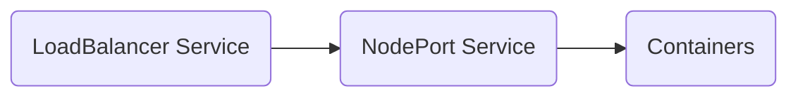
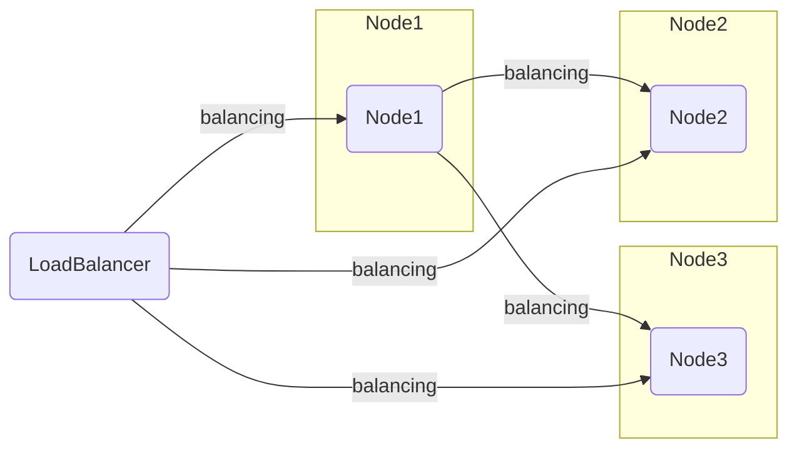
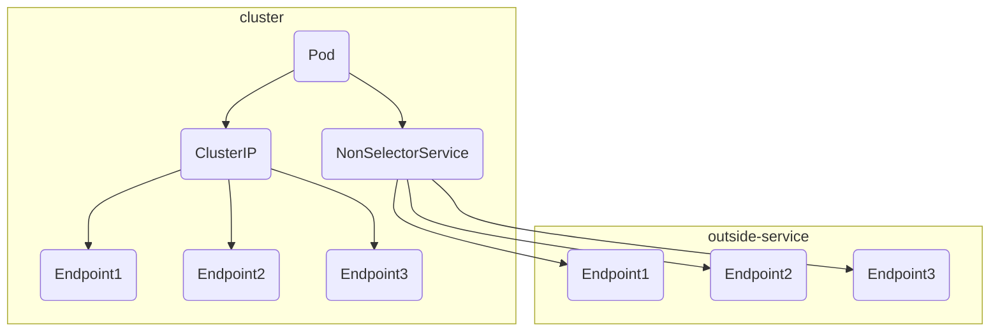
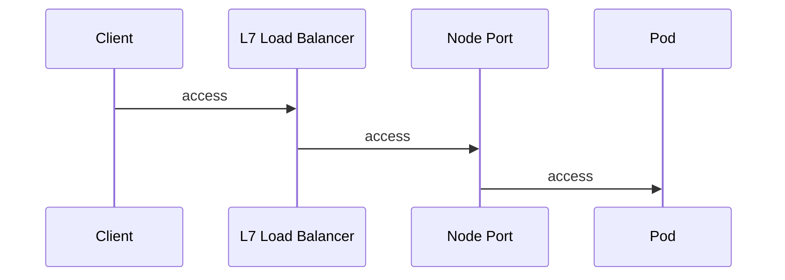
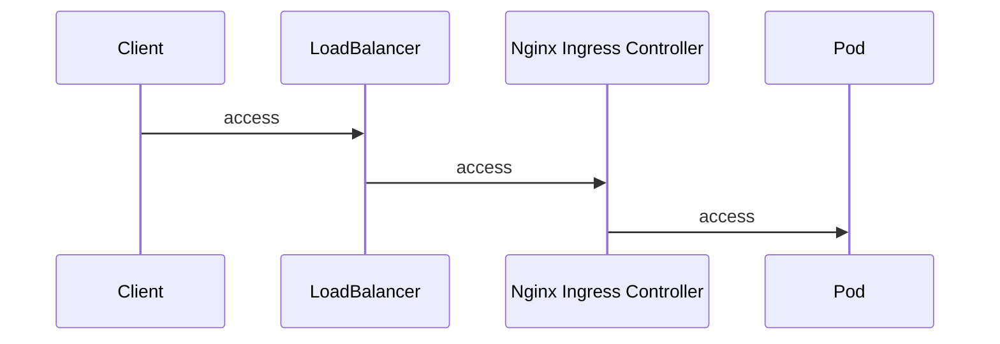

# Service API

+ Service
  + ClusterIP
  + ExternalIP
  + NodePort
  + LoadBalancer
  + Headless
  + ExternalName
  + None-Selector
+ Ingress

## Kluster Network and Service

Pod has IP Address.even if there are multiple containers in pod, there is only one IP Address.

| from | to | use ip address |
| :---- | :---- | :---- |
| A Pod | A Pod | localhost |
| A Pod | B Pod | Pod IP Address |

kubernetes assign network segment to node.
service provide endpoint.

ex) sample-deployment.yaml

```yaml
apiVersion: apps/v1
kind: Deployment
metadata:
  name: sample-deployment
spec:
  replicas: 3
  selector:
    matchLabels:
      app: sample-app
  template:
    metadata:
      labels:
        app: sample-app
    spec:
      containers:
        - name: nginx-container
          image: amsy810/echo-nginx:v2.0
```

Cluster IP provide endpoint in the kubernetes cluster.

ex) sample-clusterip.yaml

```yaml
apiVersion: v1
kind: Service
metadata:
  name: sample-clusterip
spec:
  type: ClusterIP
  ports:
  - name: "http-port"
    protocol: "TCP"
    port: 8080
    targetPort: 80
  selector:
    app: sample-app
```

```shell
kubectl apply -f sample-deployment.yaml
kubectl get pod $(kubectl get pods | tail -n 1 | awk '{print $1}') -o jsonpath='{.metadata.labels}'
# {"app":"sample-app","pod-template-hash":"5986b6f4f8"}
kubectl get pods -l app=sample-app -o custom-columns="NAME:{metadata.name},IP:{status.podIP}"
# NAME                                 IP
# sample-deployment-5986b6f4f8-5r57d   10.244.3.8
# sample-deployment-5986b6f4f8-k2gsd   10.244.5.14
# sample-deployment-5986b6f4f8-zrfd6   10.244.4.6
kubectl apply -f sample-clusterip.yaml
kubectl get service sample-clusterip
# NAME               TYPE        CLUSTER-IP     EXTERNAL-IP   PORT(S)    AGE
# sample-clusterip   ClusterIP   10.96.116.82   <none>        8080/TCP   19s
kubectl describe service sample-clusterip
# Name:              sample-clusterip
# Namespace:         default
# Labels:            <none>
# Annotations:       <none>
# Selector:          app=sample-app
# Type:              ClusterIP
# IP Family Policy:  SingleStack
# IP Families:       IPv4
# IP:                10.96.116.82
# IPs:               10.96.116.82
# Port:              http-port  8080/TCP
# TargetPort:        80/TCP
# Endpoints:         10.244.3.8:80,10.244.4.6:80,10.244.5.14:80
# Session Affinity:  None
# Events:            <none>
```

check loadbalancing

```shell
endpoint=`kubectl describe service sample-clusterip | grep "^IP:" | awk '{print $2}'`

kubectl run testpod \
  --image=amsy810/tools:v2.0 \
  --restart=Never \
  --rm \
  -i \
  --wait \
  --command -- echo "${endpoint}"
kubectl run testpod \
  --image=amsy810/tools:v2.0 \
  --restart=Never \
  --rm \
  -i \
  --command -- curl -m 2 -s "http://${endpoint}:8080"
# kubectl run -it --rm --restart=Never --image=alpine bash
# apk add curl ; curl http://${endpoint}:8080
```

### Multi port assign

ex) sample-clusterip-multi.yaml

```yaml
apiVersion: v1
kind: Service
metadata:
  name: sample-clusterip-multi
spec:
  type: ClusterIP
  ports:
  - name: "http-port"
    protocol: "TCP"
    port: 8080
    targetPort: 80
  - name: "https-port"
    protocol: "TCP"
    port: 8443
    targetPort: 443
  selector:
    app: sample-app
```

```shell
kubectl apply -f sample-clusterip-multi.yaml --dry-run=server
kubectl apply -f sample-clusterip-multi.yaml
kubectl describe service sample-clusterip-multi
```

```text
Name:              sample-clusterip-multi
Namespace:         default
Labels:            <none>
Annotations:       <none>
Selector:          app=sample-app
Type:              ClusterIP
IP Family Policy:  SingleStack
IP Families:       IPv4
IP:                10.104.63.176
IPs:               10.104.63.176
Port:              http-port  8080/TCP
TargetPort:        80/TCP
Endpoints:         10.244.1.7:80,10.244.2.26:80,10.244.3.13:80
Port:              https-port  8443/TCP
TargetPort:        443/TCP
Endpoints:         10.244.1.7:443,10.244.2.26:443,10.244.3.13:443
Session Affinity:  None
Events:            <none>
```

### use named port

ex) sample-named-port-pods.yaml

```yaml
---
apiVersion: v1
kind: Pod
metadata:
  name: sample-pod-port-pod-80
  labels:
    app: sample-app
spec:
  containers:
  - name: nginx-container
    image: amsy810/echo-nginx:v2.0
    ports: 
    - name: http
      containerPort: 80
---
apiVersion: v1
kind: Pod
metadata:
  name: sample-pod-port-pod-81
  labels:
    app: sample-app
spec:
  containers:
  - name: nginx-container
    image: amsy810/echo-nginx:v2.0
    env:
      - name: NGINX_PORT
        value: "81"
    ports:
      - name: http
        containerPort: 81
```

ex) sample-named-port-service.yaml

```yaml
apiVersion: v1
kind: Service
metadata:
  name: sample-named-port-service
spec:
  type: ClusterIP
  ports:
  - name: "http-port"
    protocol: "TCP"
    port: 8080
    targetPort: http
  selector:
    app: sample-app
```

```shell
kubectl apply -f sample-named-port-pods.yaml
kubectl apply -f sample-named-port-service.yaml
kubectl describe service sample-named-port-service
kubectl get pods -o wide
endpoint=`kubectl describe service sample-named-port-service | grep "^IP:" | awk '{print $2}'`
kubectl run testpod \
  --image=amsy810/tools:v2.0 \
  --restart=Never \
  --rm \
  -i \
  --command -- curl -m 2 -s "http://${endpoint}:8080"
```

service

```text
Name:              sample-named-port-service
Namespace:         default
Labels:            <none>
Annotations:       <none>
Selector:          app=sample-app
Type:              ClusterIP
IP Family Policy:  SingleStack
IP Families:       IPv4
IP:                10.103.193.225
IPs:               10.103.193.225
Port:              http-port  8080/TCP
TargetPort:        http/TCP
Endpoints:         10.244.2.27:80,10.244.3.14:81
Session Affinity:  None
Events:            <none>
```

pods

```text
NAME                                 READY   STATUS    RESTARTS      AGE     IP            NODE            NOMINATED NODE   READINESS GATES
sample-deployment-687d589688-cnsx8   1/1     Running   1 (18h ago)   24h     10.244.2.26   k8s-worker-02   <none>           <none>
sample-deployment-687d589688-dfk5l   1/1     Running   1 (18h ago)   24h     10.244.1.7    k8s-worker-01   <none>           <none>
sample-deployment-687d589688-s4w6z   1/1     Running   1 (18h ago)   24h     10.244.3.13   k8s-worker-03   <none>           <none>
sample-pod-port-pod-80               1/1     Running   0             4m21s   10.244.2.27   k8s-worker-02   <none>           <none>
sample-pod-port-pod-81               1/1     Running   0             4m21s   10.244.3.14   k8s-worker-03   <none>           <none>
```

result

```text
# kubectl run testpod   --image=amsy810/tools:v2.0   --restart=Never   --rm   -i   --command -- curl -m 2 -s "http://${endpoint}:8080"
Host=10.103.193.225  Path=/  From=sample-pod-port-pod-81  ClientIP=10.244.2.29  XFF=
pod "testpod" deleted
# kubectl run testpod   --image=amsy810/tools:v2.0   --restart=Never   --rm   -i   --command -- curl -m 2 -s "http://${endpoint}:8080"
Host=10.103.193.225  Path=/  From=sample-pod-port-pod-81  ClientIP=10.244.2.30  XFF=
pod "testpod" deleted
# kubectl run testpod   --image=amsy810/tools:v2.0   --restart=Never   --rm   -i   --command -- curl -m 2 -s "http://${endpoint}:8080"
Host=10.103.193.225  Path=/  From=sample-pod-port-pod-80  ClientIP=10.244.2.31  XFF=
pod "testpod" deleted
# kubectl run testpod   --image=amsy810/tools:v2.0   --restart=Never   --rm   -i   --command -- curl -m 2 -s "http://${endpoint}:8080"
Host=10.103.193.225  Path=/  From=sample-pod-port-pod-80  ClientIP=10.244.2.32  XFF=
pod "testpod" deleted
```

### DNS in cluster

service discovery provide 3 approach

+ environment variablees
+ DNS A record
+ DNS SRV record

#### Environment variables

like a `docker run --links ...`.

```shell
kubectl apply -f sample-clusterip.yaml
kubectl apply -f sample-deployment.yaml
podname=`kubectl get pods | tail -n 1 | awk '{print $1}'`
kubectl exec -it ${podname} -- env
```

```text
PATH=/usr/local/sbin:/usr/local/bin:/usr/sbin:/usr/bin:/sbin:/bin
HOSTNAME=sample-deployment-687d589688-zld6c
TERM=xterm
SAMPLE_CLUSTERIP_PORT_8080_TCP=tcp://10.106.34.16:8080
SAMPLE_CLUSTERIP_PORT_8080_TCP_ADDR=10.106.34.16
KUBERNETES_PORT_443_TCP=tcp://10.96.0.1:443
KUBERNETES_PORT_443_TCP_ADDR=10.96.0.1
KUBERNETES_PORT_443_TCP_PROTO=tcp
SAMPLE_CLUSTERIP_SERVICE_PORT=8080
KUBERNETES_SERVICE_HOST=10.96.0.1
KUBERNETES_SERVICE_PORT=443
SAMPLE_CLUSTERIP_SERVICE_PORT_HTTP_PORT=8080
SAMPLE_CLUSTERIP_PORT=tcp://10.106.34.16:8080
SAMPLE_CLUSTERIP_PORT_8080_TCP_PORT=8080
KUBERNETES_PORT_443_TCP_PORT=443
SAMPLE_CLUSTERIP_SERVICE_HOST=10.106.34.16
SAMPLE_CLUSTERIP_PORT_8080_TCP_PROTO=tcp
KUBERNETES_SERVICE_PORT_HTTPS=443
KUBERNETES_PORT=tcp://10.96.0.1:443
NGINX_VERSION=1.19.0
NJS_VERSION=0.4.1
PKG_RELEASE=1
NGINX_PORT=80
HOME=/root
```

use `enableServiceLinks` then does not set service information.

ex) sample-deployment-servicelinks.ymal

```yaml
apiVersion: apps/v1
kind: Deployment
metadata:
  name: sample-deployment
spec:
  replicas: 3
  selector:
    matchLabels:
      app: sample-app
  template:
    metadata:
      labels:
        app: sample-app
    spec:
      enableServiceLinks: false
      containers:
        - name: nginx-container
          image: amsy810/echo-nginx:v2.0
```

```shell
podname=`kubectl get pods | tail -n 1 | awk '{print $1}'`
kubectl exec -it ${podname} -- env
```

```text
PATH=/usr/local/sbin:/usr/local/bin:/usr/sbin:/usr/bin:/sbin:/bin
HOSTNAME=sample-deployment-b7798dbc6-v994j
TERM=xterm
KUBERNETES_PORT=tcp://10.96.0.1:443
KUBERNETES_PORT_443_TCP=tcp://10.96.0.1:443
KUBERNETES_PORT_443_TCP_PROTO=tcp
KUBERNETES_PORT_443_TCP_PORT=443
KUBERNETES_PORT_443_TCP_ADDR=10.96.0.1
KUBERNETES_SERVICE_HOST=10.96.0.1
KUBERNETES_SERVICE_PORT=443
KUBERNETES_SERVICE_PORT_HTTPS=443
NGINX_VERSION=1.19.0
NJS_VERSION=0.4.1
PKG_RELEASE=1
NGINX_PORT=80
HOME=/root
```

#### DNS A record

service provide dns record.

```shell
kubectl apply -f sample-clusterip.yaml
kubectl apply -f sample-deployment.yaml
# FQDN is `[service].[namespace].svc.cluster.local`
kubectl run testpod \
  --image=amsy810/tools:v2.0 \
  --rm \
  -i \
  --restart=Never \
  --command -- curl -s http://sample-clusterip:8080
kubectl run testpod \
  --image=amsy810/tools:v2.0 \
  --rm \
  -i \
  --restart=Never \
  --command -- curl -s http://sample-clusterip.default.svc.cluster.local:8080
kubectl run testpod \
  --image=amsy810/tools:v2.0 \
  --rm \
  -i \
  --restart=Never \
  --command -- dig sample-clusterip.default.svc.cluster.local
kubectl run testpod \
  --image=amsy810/tools:v2.0 \
  --rm \
  -i \
  --restart=Never \
  --command -- cat /etc/resolv.conf
serviceip=`kubectl describe service sample-clusterip | grep IP: | awk '{print $2}'`
kubectl run testpod \
  --image=amsy810/tools:v2.0 \
  --rm \
  -i \
  --restart=Never \
  --command -- dig -x ${serviceip}
```

```text
nameserver 10.96.0.10
search default.svc.cluster.local svc.cluster.local cluster.local asia-northeast1-b.c.miyata080825.internal c.miyata080825.internal google.internal
options ndots:5
pod "testpod" deleted
```

#### DNS SRV records

SRV records use protocol and port.

FQDN format is `_[port]._[protocol].[service].[namespace].svc.cluster.local`.

```shell
kubectl run testpod \
  --image=amsy810/tools:v2.0 \
  --rm \
  -i \
  --restart=Never \
  --command -- dig http://_http-port._tcp.sample-clusterip.default.svc.cluster.local
```

```text
; <<>> DiG 9.16.1-Ubuntu <<>> http://_http-port._tcp.sample-clusterip.default.svc.cluster.local
;; global options: +cmd
;; Got answer:
;; WARNING: .local is reserved for Multicast DNS
;; You are currently testing what happens when an mDNS query is leaked to DNS
;; ->>HEADER<<- opcode: QUERY, status: NXDOMAIN, id: 27520
;; flags: qr aa rd; QUERY: 1, ANSWER: 0, AUTHORITY: 1, ADDITIONAL: 1
;; WARNING: recursion requested but not available

;; OPT PSEUDOSECTION:
; EDNS: version: 0, flags:; udp: 4096
; COOKIE: cdca670ff1809c81 (echoed)
;; QUESTION SECTION:
;http://_http-port._tcp.sample-clusterip.default.svc.cluster.local. IN A

;; AUTHORITY SECTION:
cluster.local.          30      IN      SOA     ns.dns.cluster.local. hostmaster.cluster.local. 1642582035 7200 1800 86400 30

;; Query time: 19 msec
;; SERVER: 10.96.0.10#53(10.96.0.10)
;; WHEN: Wed Jan 19 09:00:02 UTC 2022
;; MSG SIZE  rcvd: 199
```

### inside cluster dns and outside cluster dns

pod use inside cluster dns when not use `dnsPolicy`.

```mermaid
graph LR;

pod(Pod)-->|query|idns(Inside cluster DNS)
idns-->|query|odns(Outside cluster DNS)
pod-->|query(use dnsPolicy)|odns
```

#### node local dns cache

node keepable dns cache for biggable cluster.

## ClusterIP Service

### create

| item | description |
| :---- | :---- |
| spec.ports[].port | receive ClusterIP port |
| spec.ports[].targetPort | receive container of pod port |

ex) sample-clusterip.yaml

```yaml
apiVersion: v1
kind: Service
metadata:
  name: sample-clusterip
spec:
  type: ClusterIP
  ports:
  - name: "http-port"
    protocol: "TCP"
    port: 8080
    targetPort: 80
  selector:
    app: sample-app
```

```shell
kubectl apply -f sample-deployment.yaml
kubectl apply -f sample-clusterip.yaml
# check trafic balanced
kubectl run testpod \
  --image=amsy810/tools:v2.0 \
  --rm \
  -i \
  --restart=Never \
  --command -- curl -s http://sample-clusterip:8080
```

### static ClusterIP

use `spec.clusterIP`

ex) sample-clusterip-vip.yaml

```yaml
apiVersion: v1
kind: Service
metadata:
  name: sample-clusterip-vip
spec:
  type: ClusterIP
  clusterIP: 10.96.254.1
  ports:
    - name: "http-port"
      protocol: "TCP"
      port: 8080
      targetPort: 80
  selector:
    app: sample-app
```

```shell
kubectl apply -f sample-clusterip-vip.yaml
kubectl describe service sample-clusterip-vip
kubectl run testpod \
  --image=amsy810/tools:v2.0 \
  --rm \
  -i \
  --restart=Never \
  --command -- dig _http-port._tcp.sample-clusterip-vip.default.svc.cluster.local
```

```text
Name:              sample-clusterip-vip
Namespace:         default
Labels:            <none>
Annotations:       <none>
Selector:          app=sample-app
Type:              ClusterIP
IP Family Policy:  SingleStack
IP Families:       IPv4
IP:                10.96.254.1
IPs:               10.96.254.1
Port:              http-port  8080/TCP
TargetPort:        80/TCP
Endpoints:         10.244.1.14:80,10.244.2.37:80,10.244.3.19:80
Session Affinity:  None
Events:            <none>
```

## ExternalIP Service

ExternalIP Service redirect container from specific node IP.recommended use NodePort Service.
ip address need node os binding.

### Create

| item | description |
| :----- | :------ |
| spec.externalIPs[] | node ip address.`kubectl get nodes -o wide` INTERNAL-IP. |
| spec.ports[].port | receive port number on cluster ip |
| spec.ports[].targetPort | container port no on Container |

ex) sample-externalip.yaml

```yaml
apiVersion: v1
kind: Service
metadata:
  name: sample-externalip
spec:
  type: ClusterIP
  externalIPs:
    - 10.146.0.13
  ports:
    - name: "http-port"
      protocol: "TCP"
      port: 8080
      targetPort: 80
  selector:
    app: sample-app
```

```shell
kubectl get nodes -o wide | grep worker | tail -n 1
kubectl apply -f sample-externalip.yaml
kubectl describe service sample-externalip
kubectl run testpod \
  --image=amsy810/tools:v2.0 \
  --rm \
  -i \
  --restart=Never \
  --command -- dig sample-externalip.default.svc.cluster.local
```

```text
Name:              sample-externalip
Namespace:         default
Labels:            <none>
Annotations:       <none>
Selector:          app=sample-app
Type:              ClusterIP
IP Family Policy:  SingleStack
IP Families:       IPv4
IP:                10.105.162.254
IPs:               10.105.162.254
External IPs:      10.146.0.13
Port:              http-port  8080/TCP
TargetPort:        80/TCP
Endpoints:         10.244.1.15:80,10.244.2.50:80,10.244.3.20:80
Session Affinity:  None
Events:            <none>
```

```text
; <<>> DiG 9.16.1-Ubuntu <<>> sample-externalip.default.svc.cluster.local
;; global options: +cmd
;; Got answer:
;; WARNING: .local is reserved for Multicast DNS
;; You are currently testing what happens when an mDNS query is leaked to DNS
;; ->>HEADER<<- opcode: QUERY, status: NOERROR, id: 26771
;; flags: qr aa rd; QUERY: 1, ANSWER: 1, AUTHORITY: 0, ADDITIONAL: 1
;; WARNING: recursion requested but not available

;; OPT PSEUDOSECTION:
; EDNS: version: 0, flags:; udp: 4096
; COOKIE: 359d78b141872aa4 (echoed)
;; QUESTION SECTION:
;sample-externalip.default.svc.cluster.local. IN        A

;; ANSWER SECTION:
sample-externalip.default.svc.cluster.local. 30 IN A 10.105.162.254

;; Query time: 16 msec
;; SERVER: 10.96.0.10#53(10.96.0.10)
;; WHEN: Wed Jan 19 11:46:08 UTC 2022
;; MSG SIZE  rcvd: 143
```

## NodePort Service

NodePort Service like a all node redirect ExternalIP service.

| item | description |
| :----- | :----- |
| spec.ports[].port | receive port on ClusterIP |
| spec.ports[].targetPort | receive port on Container |
| spec.ports[].nodePort | receive port on All Node.default range is between 30000 to 32767 |

### Create

ex) sample-nodeport.yaml

```yaml
apiVersion: v1
kind: Service
metadata:
  name: sample-nodeport
spec:
  type: NodePort
  ports:
    - name: "http-port"
      protocol: "TCP"
      port: 8080
      targetPort: 80
      nodePort: 30080
  selector:
    app: sample-app
```

```shell
kubectl apply -f sample-nodeport.yaml
kubectl describe service sample-nodeport
kubectl run testpod \
  --image=amsy810/tools:v2.0 \
  --rm \
  -i \
  --restart=Never \
  --command -- dig sample-nodeport.default.svc.cluster.local
```

```text
Name:                     sample-nodeport
Namespace:                default
Labels:                   <none>
Annotations:              <none>
Selector:                 app=sample-app
Type:                     NodePort
IP Family Policy:         SingleStack
IP Families:              IPv4
IP:                       10.106.195.182
IPs:                      10.106.195.182
Port:                     http-port  8080/TCP
TargetPort:               80/TCP
NodePort:                 http-port  30080/TCP
Endpoints:                10.244.1.15:80,10.244.2.50:80,10.244.3.20:80
Session Affinity:         None
External Traffic Policy:  Cluster
Events:                   <none>
```

```text
; <<>> DiG 9.16.1-Ubuntu <<>> sample-nodeport.default.svc.cluster.local
;; global options: +cmd
;; Got answer:
;; WARNING: .local is reserved for Multicast DNS
;; You are currently testing what happens when an mDNS query is leaked to DNS
;; ->>HEADER<<- opcode: QUERY, status: NOERROR, id: 30173
;; flags: qr aa rd; QUERY: 1, ANSWER: 1, AUTHORITY: 0, ADDITIONAL: 1
;; WARNING: recursion requested but not available

;; OPT PSEUDOSECTION:
; EDNS: version: 0, flags:; udp: 4096
; COOKIE: 6252d38a7b8bb350 (echoed)
;; QUESTION SECTION:
;sample-nodeport.default.svc.cluster.local. IN A

;; ANSWER SECTION:
sample-nodeport.default.svc.cluster.local. 30 IN A 10.106.195.182

;; Query time: 20 msec
;; SERVER: 10.96.0.10#53(10.96.0.10)
;; WHEN: Wed Jan 19 11:59:10 UTC 2022
;; MSG SIZE  rcvd: 139
```

check worker node shell prompt

```shell
ss -napt | grep 30080
```

NordPort out of range

ex) sample-nodeport-fail.yaml

```yaml
apiVersion: v1
kind: Service
metadata:
  name: sample-nodeport-fail
spec:
  type: NodePort
  ports:
    - name: "http-port"
      protocol: "TCP"
      port: 8080
      port: 80
      nodePort: 8888
  selector:
    app: sample-app
```

```shell
# no error
kubectl apply -f sample-nodeport-fail.yaml --dry-run=server
kubectl apply -f sample-nodeport-fail.yaml
```

```text
The Service "sample-nodeport-fail" is invalid: spec.ports[0].nodePort: Invalid value: 8888: provided port is not in the valid range. The range of valid ports is 30000-32767
```

not allow same NortPort.

ex) sample-nodeport-fail2.yaml

```yaml
apiVersion: v1
kind: Service
metadata:
  name: sample-nodeport-fail2
spec:
  type: NodePort
  ports:
    - name: "http-port"
      protocol: "TCP"
      port: 8080
      targetPort: 80
      nodePort: 30080
  selector:
    app: sample-app
```

```shell
kubectl apply -f sample-nodeport-fail2.yaml --dry-run=server
kubectl apply -f sample-nodeport-fail2.yaml
```

```text
The Service "sample-nodeport" is invalid: spec.ports[0].nodePort: Invalid value: 30080: provided port is already allocated
```

## LoadBalancer Service

provided this service by GCP,AWS,Azure,OpenStack.



### Create

ex) sample-lb.yaml

```yaml
apiVersion: v1
kind: Service
metadata:
  name: sample-lb
spec:
  type: LoadBalancer
  ports:
    - name: "http-port"
      protocol: "TCP"
      port: 8080
      targetPort: 80
      nodePort: 30082
  selector:
    app: sample-app
```

```shell
kubectl apply -f sample-lb.yaml --dry-run=server
kubectl apply -f sample-lb.yaml
kubectl describe service sample-lb
```

```text
Name:                     sample-lb
Namespace:                default
Labels:                   <none>
Annotations:              <none>
Selector:                 app=sample-app
Type:                     LoadBalancer
IP Family Policy:         SingleStack
IP Families:              IPv4
IP:                       10.106.213.72
IPs:                      10.106.213.72
Port:                     http-port  8080/TCP
TargetPort:               80/TCP
NodePort:                 http-port  30082/TCP
Endpoints:                10.244.1.19:80,10.244.2.53:80,10.244.3.21:80
Session Affinity:         None
External Traffic Policy:  Cluster
Events:                   <none>
```

LoadBalancer EXTERNAL-IP is `<pending>`.this is wait GCP processing.

```shell
kubectl get services
```

```text
kubectl get service sample-lb
NAME              TYPE           CLUSTER-IP      EXTERNAL-IP   PORT(S)          AGE
sample-lb         LoadBalancer   10.106.213.72   <pending>     8080:30082/TCP   84s
```

### static IP

+ create GCP -> VPC Network -> external IP address

ex) sample-lb-fixip.yaml

```yaml
apiVersion: v1
kind: Service
metadata:
  name: sample-lb-fixip
spec:
  type: LoadBalancer
  loadBalancerIP: 35.200.66.2
  selector:
    app: sample-app
  ports:
    - name: "http-port"
      protocol: "TCP"
      port: 8080
      targetPort: 80
      nodePort: 30082
```

### Firewall

default setting is `0.0.0.0/0`(All allow).

ex) sample-lb-fw.yaml

```yaml
apiVersion: v1
kind: Service
metadata:
  name: sample-lb-fw
spec:
  type: LoadBalancer
  selector: 
    app: sample-app
  ports:
    - name: "http-port"
      protocol: "TCP"
      port: 8080
      targetPort: 80
  loadBalancerSourceRanges:
    - 10.0.0.0/8
```

```shell
kubectl apply -f sample-lb-fw.yaml
```

## Others

### session afinity

use `spec.sessionAfinity`. default is `None`.

ex) sample-session-affinity.yaml

```yaml
apiVersion: v1
kind: Service
metadata:
  name: sample-session-affinity
spec:
  type: LoadBalancer
  selector:
    app: sample-app
  ports:
    - name: "http-port"
      protocol: "TCP"
      port: 8080
      targetPort: 80
      nodePort: 30084
  sessionAffinity: ClientIP
  sessionAffinityConfig:
    clientIP:
      timeoutSeconds: 10
```

```shell
kubectl apply -f sample-session-affinity.yaml
kubectl get services
podname=`kubectl get pods | tail -n 1 | awk '{print $1}'`
kubectl exec \
  -it \
  ${podname} \
  -- curl http://sample-session-affinity.default.svc.cluster.local:8080
kubectl patch service sample-session-affinity -p '{"spec": {"sessionAffinity": "None"}}'
kubectl exec \
  -it \
  ${podname} \
  -- curl http://sample-session-affinity.default.svc.cluster.local:8080
```

```text
NAME                      TYPE           CLUSTER-IP      EXTERNAL-IP   PORT(S)          AGE
kubernetes                ClusterIP      10.96.0.1       <none>        443/TCP          18h
sample-session-affinity   LoadBalancer   10.102.58.244   <pending>     8080:30084/TCP   4s
```

### remove traffic between node and node



remove unnecessary traffic using `spec.externalTrafficPolicy`. ex when using DaemonSet.it policy is usable on NodePort and LoadBalancer.

| value | description |
| :----- | :----- |
| Cluster | default value.load balancing node to pods |
| Local | non load balancing when traffic arrival to node |

ex) sample-nodeport-local.yaml

```yaml
apiVersion: v1
kind: Service
metadata:
  name: sample-nodeport-local
spec:
  type: NodePort
  externalTrafficPolicy: Local
  ports:
    - name: "http-port"
      protocol: "TCP"
      port: 8080
      targetPort: 80
      nodePort: 30081
  selector:
    app: sample-app
```

```shell
kubectl apply -f sample-nodeport-local.yaml --dry-run=server
kubectl apply -f sample-nodeport-local.yaml
kubectl get services
kubectl describe service sample-nodeport-local
```

```text
# kubectl get services
NAME                    TYPE        CLUSTER-IP     EXTERNAL-IP   PORT(S)          AGE
kubernetes              ClusterIP   10.96.0.1      <none>        443/TCP          25h
sample-nodeport-local   NodePort    10.109.73.35   <none>        8080:30081/TCP   7s
# kubectl describe service sample-nodeport-local
Name:                     sample-nodeport-local
Namespace:                default
Labels:                   <none>
Annotations:              <none>
Selector:                 app=sample-app
Type:                     NodePort
IP Family Policy:         SingleStack
IP Families:              IPv4
IP:                       10.109.73.35
IPs:                      10.109.73.35
Port:                     http-port  8080/TCP
TargetPort:               80/TCP
NodePort:                 http-port  30081/TCP
Endpoints:                10.244.1.7:80,10.244.2.3:80,10.244.3.3:80
Session Affinity:         None
External Traffic Policy:  Local
Events:                   <none>
```

```shell
workerip=`kubectl get nodes -o wide | grep k8s-worker-01 | awk '{ print $6}'`
curl -l http://${workerip}:30081
# Host=10.146.0.22  Path=/  From=sample-deployment-687d589688-skxct  ClientIP=10.146.0.21  XFF=
```

usable healthCheckNodePort policy when use externalTrafficPolicy is Local and type is LoadBalancer.

ex) sample-lb-local-healthcheckpolicy.yaml

```yaml
apiVersion: v1
kind: Service
metadata:
  name: sample-lb-local
spec:
  type: LoadBalancer
  externalTrafficPolicy: Local
  healthCheckNodePort: 30086
  ports:
    - name: "http-port"
      protocol: "TCP"
      port: 8080
      targetPort: 80
      nodePort: 30085
  selector:
    app: sample-app
```

```shell
kubectl apply -f sample-lb-local-healthcheckpolicy.yaml --dry-run=server
kubectl apply -f sample-lb-local-healthcheckpolicy.yaml
workerip=`kubectl get nodes -o wide | grep k8s-worker-01 | awk '{ print $6}'`
curl -l http://${workerip}:30086
```

```text
{
        "service": {
                "namespace": "default",
                "name": "sample-lb-local"
        },
        "localEndpoints": 1
}
```

### East-West traffic(Topology-aware Service Routing)

externalTrafficPolicy

+ can not on ClusterIP
+ transport range is same nodes
+ raise timeout when pod not run on node

ex) sample-service-topology.yaml

```yaml
apiVersion: v1
kind: Service
metadata:
  name: sample-service-topology
spec:
  type: ClusterIP
  selector:
    app: sample-app
  ports:
    - name: "http-port"
      protocol: "TCP"
      port: 8080
      targetPort: 80
  topologyKeys:
    - kubernetes.io/hostname
    - "*"
```

```shell
kubectl apply -f sample-service-topology.yaml --dry-run=server
```

## Headless Service

Headless Service return Pod IP Address.Headless Service provide endpoint using DNS Round Robin.
StatefulSet condition

+ spec.type is `ClusterIP`
+ spec.clusterIP is `None`
+ metadata.name is StatefulSet.spec.serviceName

### create

ex) sample-headless.yaml

```yaml
apiVersion: v1
kind: Service
metadata:
  name: sample-headless
spec:
  type: ClusterIP
  clusterIP: None
  ports:
    - name: "http-port"
      protocol: "TCP"
      port: 80
      targetPort: 80
  selector:
    app: sample-app
```

ex) sample-stateful-headless.yaml

```yaml
apiVersion: apps/v1
kind: StatefulSet
metadata:
  name: sample-statefulset-headless
spec:
  serviceName: sample-headless
  replicas: 3
  selector:
    matchLabels:
      app: sample-app
  template:
    metadata:
      labels:
        app: sample-app
    spec:
      containers:
        - name: nginx-container
          image: amsy810/echo-nginx:v2.0
```

```shell
kubectl apply -f sample-stateful-headless.yaml
kubectl apply -f sample-headless.yaml
```

### resolve pod name

Headless Service return pod ip address

```shell
kubectl get nodes -o wide
kubectl get pods -o wide
```

```text
# nodes
NAME            STATUS   ROLES                  AGE   VERSION   INTERNAL-IP   EXTERNAL-IP   OS-IMAGE                       KERNEL-VERSION          CONTAINER-RUNTIME
k8s-master-01   Ready    control-plane,master   26h   v1.22.5   10.146.0.21   <none>        Debian GNU/Linux 10 (buster)   4.19.0-18-cloud-amd64   docker://20.10.12
k8s-worker-01   Ready    <none>                 25h   v1.22.5   10.146.0.22   <none>        Debian GNU/Linux 10 (buster)   4.19.0-18-cloud-amd64   docker://20.10.12
k8s-worker-02   Ready    <none>                 25h   v1.22.5   10.146.0.23   <none>        Debian GNU/Linux 10 (buster)   4.19.0-18-cloud-amd64   docker://20.10.12
k8s-worker-03   Ready    <none>                 25h   v1.22.5   10.146.0.24   <none>        Debian GNU/Linux 10 (buster)   4.19.0-18-cloud-amd64   docker://20.10.12
# pods
NAME                                 READY   STATUS    RESTARTS      AGE     IP           NODE            NOMINATED NODE   READINESS GATES
sample-deployment-687d589688-kw8dc   1/1     Running   1 (25h ago)   25h     10.244.1.7   k8s-worker-02   <none>           <none>
sample-deployment-687d589688-skxct   1/1     Running   1 (25h ago)   25h     10.244.2.3   k8s-worker-01   <none>           <none>
sample-deployment-687d589688-zdwqf   1/1     Running   1 (25h ago)   25h     10.244.3.3   k8s-worker-03   <none>           <none>
sample-statefulset-headless-0        1/1     Running   0             2m43s   10.244.2.4   k8s-worker-01   <none>           <none>
sample-statefulset-headless-1        1/1     Running   0             2m41s   10.244.3.4   k8s-worker-03   <none>           <none>
sample-statefulset-headless-2        1/1     Running   0             2m39s   10.244.1.8   k8s-worker-02   <none>           <none>
```

```shell
kubectl run testpod \
  --image=amsy810/tools:v2.0 \
  --restart=Never \
  --rm \
  -i \
  --command -- dig sample-headless.default.svc.cluster.local
```

```text
; <<>> DiG 9.16.1-Ubuntu <<>> sample-headless.default.svc.cluster.local
;; global options: +cmd
;; Got answer:
;; WARNING: .local is reserved for Multicast DNS
;; You are currently testing what happens when an mDNS query is leaked to DNS
;; ->>HEADER<<- opcode: QUERY, status: NOERROR, id: 63102
;; flags: qr aa rd; QUERY: 1, ANSWER: 6, AUTHORITY: 0, ADDITIONAL: 1
;; WARNING: recursion requested but not available

;; OPT PSEUDOSECTION:
; EDNS: version: 0, flags:; udp: 4096
; COOKIE: 4a4152e0d3b8ef42 (echoed)
;; QUESTION SECTION:
;sample-headless.default.svc.cluster.local. IN A

;; ANSWER SECTION:
sample-headless.default.svc.cluster.local. 30 IN A 10.244.1.8
sample-headless.default.svc.cluster.local. 30 IN A 10.244.3.4
sample-headless.default.svc.cluster.local. 30 IN A 10.244.2.4
sample-headless.default.svc.cluster.local. 30 IN A 10.244.2.3
sample-headless.default.svc.cluster.local. 30 IN A 10.244.3.3
sample-headless.default.svc.cluster.local. 30 IN A 10.244.1.7

;; Query time: 16 msec
;; SERVER: 10.96.0.10#53(10.96.0.10)
;; WHEN: Fri Jan 21 09:39:38 UTC 2022
;; MSG SIZE  rcvd: 424
```

```shell
kubectl run testpod \
  --image=amsy810/tools:v2.0 \
  --restart=Never \
  --rm \
  -i \
  --command -- dig sample-statefulset-headless-0.sample-headless.default.svc.cluster.local
```

```text
; <<>> DiG 9.16.1-Ubuntu <<>> sample-statefulset-headless-0.sample-headless.default.svc.cluster.local
;; global options: +cmd
;; Got answer:
;; WARNING: .local is reserved for Multicast DNS
;; You are currently testing what happens when an mDNS query is leaked to DNS
;; ->>HEADER<<- opcode: QUERY, status: NOERROR, id: 5093
;; flags: qr aa rd; QUERY: 1, ANSWER: 1, AUTHORITY: 0, ADDITIONAL: 1
;; WARNING: recursion requested but not available

;; OPT PSEUDOSECTION:
; EDNS: version: 0, flags:; udp: 4096
; COOKIE: 9e864e1be1517754 (echoed)
;; QUESTION SECTION:
;sample-statefulset-headless-0.sample-headless.default.svc.cluster.local. IN A

;; ANSWER SECTION:
sample-statefulset-headless-0.sample-headless.default.svc.cluster.local. 30 IN A 10.244.2.4

;; Query time: 16 msec
;; SERVER: 10.96.0.10#53(10.96.0.10)
;; WHEN: Fri Jan 21 09:41:34 UTC 2022
;; MSG SIZE  rcvd: 199
```

### resolve ip address without StatefulSet

ex) sample-subdomain.yaml

```yaml
---
apiVersion: v1
kind: Pod
metadata:
  name: sample-subdomain
  labels:
    app: sample-app
spec:
  hostname: sample-hostname
  subdomain: sample-subdomain
  containers:
    - name: nginx-container
      image: amsy810/tools:v2.0
---
apiVersion: v1
kind: Service
metadata:
  name: sample-subdoamin
spec:
  type: ClusterIP
  clusterIP: None
  ports: []
  selector:
    app: sample-app
```

```shell
kubectl delete deployments --all
kubectl delete services --all
kubectl apply -f sample-subdomain.yaml
kubectl get pods -o wide
```

```text

```

```shell
kubectl run testpod \
  --image=amsy810/tools:v2.0 \
  --restart=Never \
  --rm \
  -i \
  --command -- dig sample-hostname.sample-subdomain.default.svc.cluster.local
```

## ExternalName Service

ExternalName Service provide Domain CNAME for outside.usecase is change endpoint.
check `spec.clusterIP` when chenge ExternalName Service to ClusterIP Service.

### create

ex) sample-externalname.yaml

```yaml
apiVersion: v1
kind: Service
metadata:
  name: sample-externalname
spec:
  type: ExternalName
  externalName: external.example.com
```

```shell
kubectl apply -f sample-externalname.yaml --dry-run=service
kubectl apply -f sample-externalname.yaml
kubectl get services
# FQDN [service].[namespace].svc.cluster.local
kubectl run testpod \
  --image=amsy810/tools:v2.0 \
  --rm \
  -i \
  --command -- dig sample-externalname.default.svc.cluster.local CNAME
```

## Non-Selector Service

outside service loadbalancing.



### create 

condition

+ do not set selector to service
+ same name service and endpoints

ex) sample-non-selector.yaml

```yaml
---
apiVersion: v1
kind: Service
metadata:
  name: sample-non-selector
spec:
  type: ClusterIP
  ports:
    - protocol: "TCP"
      port: 8080
      targetPort: 80
---
apiVersion: v1
kind: Endpoints
metadata:
  name: sample-non-selector
subsets:
  - addresses:
    - ip: 192.168.1.1
    - ip: 192.168.1.2
    prots:
    - protocol: "TCP"
      port: 80
```

```shell
kubectl apply -f sample-non-selector.yaml
kubectl describe service sample-non-selector
```

## Ingress

Ingress provide L7 LoadBalancing.

### kind of ingress

+ GKE Ingress: use out of cluster load balancer
+ Nginx Ingress: create pod for ingress to cluster

GKE Ingress



HttpLoadBalancer enabling when create cluster on GKE.

Nginx Ingress



see [](https://github.com/kubernetes/ingress-nginx/tree/main/deploy)

```shell
kubectl apply -f https://raw.githubusercontent.com/kubernetes/ingress-nginx/controller-v1.1.1/deploy/static/provider/cloud/deploy.yaml
```

### prepair

need service before create ingress

ex) sample-ingress-apps.yaml

```yaml
---
apiVersion: v1
kind: Service
metadata:
  name: sample-ingress-svc-1
spec:
  type: NodePort
  ports:
    - name: "http-port"
      protocol: "TCP"
      port: 8888
      targetPort: 80
  selector:
    ingress-app: sample1
---
apiVersion: v1
kind: Pod
metadata:
  name: sample-ingress-apps-1
  labels:
    ingress-app: sample1
spec:
  containers:
    - name: nginx-container
      image: amsy810/echo-nginx:v2.0
---
apiVersion: v1
kind: Service
metadata:
  name: sample-ingress-svc-2
spec:
  type: NodePort
  ports:
    - name: "http-port"
      protocol: "TCP"
      port: 8888
      targetPort: 80
  selector:
    ingress-app: sample2
---
apiVersion: v1
kind: Pod
metadata:
  name: sample-ingress-apps-2
  labels:
    ingress-app: sample2
spec:
  containers:
    - name: nginx-container
      image: amsy810/echo-nginx:v2.0
---
apiVersion: v1
kind: Service
metadata:
  name: sample-ingress-default
spec:
  type: NodePort
  selector:
    ingress-app: default
  ports:
    - name: "http-port"
      protocol: "TCP"
      port: 8888
      targetPort: 80
---
apiVersion: v1
kind: Pod
metadata:
  name: sample-ingress-default
  labels:
    ingress-app: default
spec:
  containers:
    - name: nginx-container
      image: amsy810/echo-nginx:v2.0
```

```shell
kubectl apply -f sample-ingress-apps.yaml
```

https need certificates

```shell
openssl req \
  -x509 \
  -nodes \
  -days 3650 \
  -newkey rsa:2048 \
  -keyout ~/tls.key \
  -out ~/tls.crt \
  -subj "/CN=sample.example.com"
kubectl create secret tls \
  --save-config tls-sample \
  --key ~/tls.key \
  --cert ~/tls.crt
# or
# kubectl apply -f tls-sample.yaml
```

### create ingress

redirect pass specify `request path > service backend` pair.
`spec.rules[].http.paths[].backend.servicePort` is `spec.ports[].port` of service. 

for GKE

ex) sample-ingress.yaml

```yaml
apiVersion: networking.k8s.io/v1beta1
kind: Ingress
metadata:
  name: sample-ingress
spec:
  rules:
    - host: sample.example.com
      http:
        paths:
          - path: /path1/*
            backend: 
              serviceName: sample-ingress-svc-1
              servicePort: 8888
          - path: /path2/*
            backend:
              serviceName: sample-ingress-svc-2
              servicePorrt: 8888
  backend:
    serviceName: sample-example-default
    servicePort: 8888
  tls:
    - host:
      - sample.example.com
      secretName: tls-sample
```

+ `/path1/*` -> `sample-ingress-svc-1 Service` -> `sample-ingress-app1 Pod`
+ `/path2/*` -> `sample-ingress-svc-2 Service` -> `sample-ingress-app2 Pod`
+ `*` -> `sample-ingress-default Service` -> `sample-ingress-default Pod`

```shell
kubectl apply -f sample-ingress.yaml
kubectl get ingresses
INGRESS_IP =`kubectl get ingress sample-ingress -o jsonpath ='{.status.loadBalancer.ingress[0].ip}'`
curl http://${INGRESS_IP}/path1/
curl http://${INGRESS_IP}/path2/
curl http://${INGRESS_IP}/
```

for Nginx Ingress

ex) sample-ingress-by-nginx.yaml

```yaml
apiVersion: networking.k8s.io/v1beta1
kind: Ingress
metadata:
  name: sample-ingress-by-nginx
  annotation:
    kubernetes.io/ingress.class: nginx
    nginx.ingress.kubernetes.io/ssl-redirect: "false"
spec:
  rules:
    - host: sample.example.com
      http:
        paths:
          - path: /path1/*
            backend: 
              serviceName: sample-ingress-svc-1
              servicePort: 8888
          - path: /path2/*
            backend:
              serviceName: sample-ingress-svc-2
              servicePorrt: 8888
  backend:
    serviceName: sample-example-default
    servicePort: 8888
  tls:
    - host:
      - sample.example.com
      secretName: tls-sample
```

```shell
kubectl apply -f sample-ingress-by-nginx.yaml
kubectl get ingresses
kubectl get services -n ingress-nginx
INGRESS_IP =`kubectl get ingress sample-ingress-by-nginx -o jsonpath ='{.status.loadBalancer.ingress[0].ip}'`
curl http://${INGRESS_IP}/path1/
curl http://${INGRESS_IP}/path2/
curl http://${INGRESS_IP}/
```

### X-Forward-For(XFF) client ip address in the header

traffic have client ip address in header xff pass throu ingress

### split ingress

ingress controller watch ingress resource.want ingress controller,use ingress class annotation.
`kubernetes.io/ingress.class: "system_a"`.

