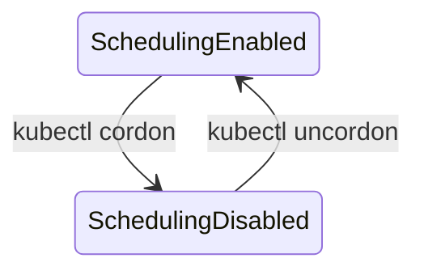

# node maintenance

need process when node safety stop.

## cordon/uncordon

kubernetes nodes has status `SchedulingEnabled` or `SchecdulingDisabled`.
SchedulingDisable node is off schedule(not add pod).



change SchedulingDisaled.

```shell
nodeid=`kubectl get nodes | tali -n 1 | awk '{print $1}'`
kubectl cordon ${nodeid}
```

change SchedulingEnabled.

```shell
nodeid=`kubectl get nodes | tali -n 1 | awk '{print $1}'`
kubectl uncordon ${nodeid}
```

## drain

running pod drain on node be stoppable.non need `kubectl cordon`.

```shell
nodeid=`kubectl get nodes | tali -n 1 | awk '{print $1}'`
kubectl drain ${nodeid} --force --ignore-deamonsets
```

have 3 error case

+ pod not managed by ReplicationController, ReplicaSet,Job, DaemonSet or StatefulSet
  + answer: add `--force` option
+ pod with local storage
  + answer: add `--delete-local-data`
+ DaemonSet-managed pod
  + answer: add `--ignore-daemonsets`

## PodDistruptionBudget

PodDistruptionBudget is stopable pod count limitage resource when drain.
purpose is avoid downtime when stop all replicas in Deployment.

ex) sample-pod-distruption-budget.yaml

```yaml
apiVersion: v1
kind: PodDistruptionBudget
metadata:
  name: sample-pod-distruption-budget
spec:
  minAvairable: 1
  # or maxUnavairable: 1
  # or minAvairable: 90%
  # or maxUnavairable: 10%
  selector:
    matchLabels:
      app: sample-app
```

```shell
kubectl apply -f sample-pod-distruption-budget.yaml
```
