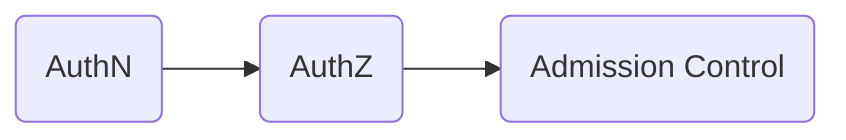
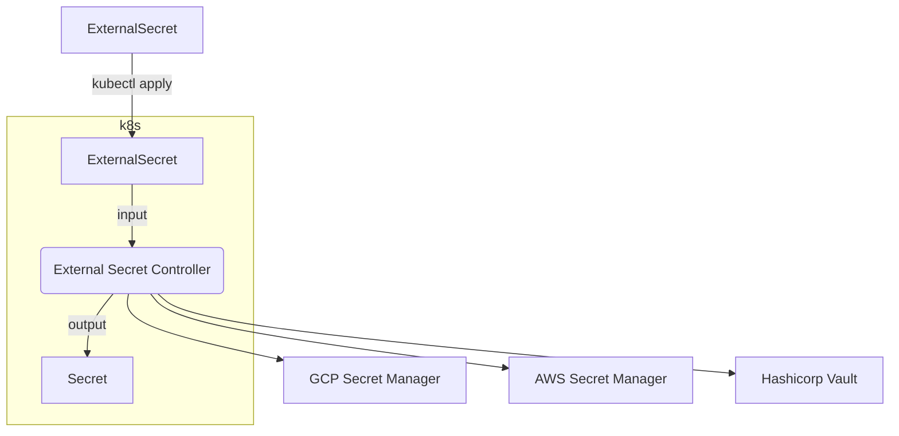

# Security

k8s has concept like a user.`UserAccount` and `ServiceAccount`.

+ `UserAccount` is GKE's Google account and EKS IAM.cluster level information.
+ `ServiceAccount` is used for pod process.link to Namespace.

## Create ServiceAccount

```shell
kubectl create serviceaccount sample-serviceaccount
```

set `imagePullSecrets` of Secret when get image from private repository with authenticate.

```shell
kubectl patch serviceaccount sample-serviceaccount \
  -P '{\"imagePullSecrets\": [{\"name\": \"myregistrykey\"}]}'
```

use manifest

```yaml
apiVersion: v1
kind: ServiceAccount
metadata:
  name: sample-serviceaccount
  namespace: default
imagePullSecrets:
- name: myregistrykey
```

## ServiceAccount and Token

ServiceAccount has secrets property.`secrets` property is `kubernetes.io/service-account-token` type.It is K8s API certificates.

```shell
kubectl get serviceaccount sample-serviceaccount -o yaml
```

```yaml
```

ServiceAcccount for Pod.

ex) sample-serviceaccount-pod.yaml

```yaml
apiVersion: v1
kind: Pod
metadata:
  name: sample-serviceaccount-pod
  namespace: default
spec:
  containers:
    - name: nginx-container
      image: nginx:1.16
  serviceAccountName: sample-serviceaccount
```

```shell
kubectl get pod sample-serviceaccount-pod -o yaml
kubectl exec -it sample-serviceaccount-pod -- ls /var/run/secrets/kubernetes.io/serviceaccount/
kubectl exec -it sampel-serviceaccount-pod -- /bin/bash
# into pod
apt update && apt -y install curl
TOKEN=`cat /var/run/secrets/kubernetes.io/serviceaccount/token`
curl -L -H "Authorization: Bearer ${TOKEN}" \
  --cacert /var/run/secrets/kubernetes.io/serviceaccount/ca.crt \
  https://kubernetes/api/v1/namespaces/default/pod
```

ServiceAccount mount token at auto.auto mount is settable disable.

ex) sample-serivceaccount-noautomount.yaml

```yaml
apiVersion: v1
kind: ServiceAccount
metadata:
  name: sample-serviceaccount-noautomount
  namespace: default
automountServiceAccountToken: false
```

will use token in pod

ex) sample-serviceaccount-noautomount-pod.yaml

```yaml
apiVersion: v1
kind: Pod
metadata:
  name: sample-serviceaccount-noautomount-pod
  namespace: default
spec:
  containers:
    - name: nginx-container
      image: nginx:1.16
  serviceAccountName: sample-serviceaccount-noautomount
  automountServiceAccountToken: true
```

## Client liberary and authorized

client library is `kubernetes/client-go`.It has two approach.

+ Use ServiceAccount token(In-Cluster Config)
+ use kubeconfig

### Use ServiceAccount token

Pod has token.

```go
config, err := rest.InClusterConfig()
clientset, err := kubernetes.NewForConfig(config)
```

### Use kubeconfig

Access from outside of cluster.

```go
config, err := clientcmd.BuildConfigFromFlags("", *kubeconfig)
clientset, err := kubernetes.NewForConfig(config)
```

## Certificate information of Docker registory

ex) sample-serviceaccount-pullsecrets.yaml

```yaml
apiVersion: v1
kind: ServiceAccount
metadata:
  name: sample-serviceacckount-pullsecrets
imagePullSecrets:
- name: sample-registry-auth
```

ex) sample-serviceaccount-pullsecrets-pod.yaml

```yaml
apiVersion: v1
kind: Pod
metadata:
  name: sample-serviceaccount-pullsecrets-pod
spec:
  containers:
    - name: nginx-container
      image: nginx:1.16
  serviceAccountName: sample-serviceaccoutn-pullsecrets
```

## RBAC(Role Based Access Control)

RBAC is Role binding to ServiceAccount.RoleBinding has resource 2 type.Namespace level and Cluster level.ABAC(Attributes Based Access Control) renamed RBAC.

+ Namespace level
  + Role, RoleBinding
+ Cluster level
  + ClusterRole, ClusterRoleBinding

### Role and ClusterRole

Role and ClusterRole permit access for Namespace scope resource.ClusterRole permit access for `Node`, `Namespace`, `PersistentVolume` and nonResourceURL(/version, /healthz. kubernetes API).
main parameter is `apiGroups`, `resources` and `verbs`.

+ apiGroups and resources: specify resource
+ verbs: permit power

| verbs | description |
| :----- | :----- |
| `*` | all |
| create | create resource |
| delete | delete resource |
| get | read resoruce |
| list | show list resource |
| patch | change resource |
| update | update resource |
| watch | watch resource |

#### Create Role

ex) sample-role.yaml

```yaml
apiVersion: rbac.authorization.k8s.io/v1
kind: Role
metadata:
  name: sample-role
  namespace: default
rules:
- apiGroups:
  - apps
  - extensions
  resources:
  - replicaSets
  - deployments
  - deployments/scale
  verbs:
  - "*"
```

#### Create ClusterRole

ex) sample-cluster-role.yaml

```yaml
apiVersion: rbac.authorization.k8s.io/v1
kind: ClusterRole
metadata:
  name: sample-cluster-role
  # can not specify namespace
rules:
- apiGroups:
  - apps
  - extensions
  resources:
  - replicaSets
  - deployments
  verbs:
  - get
  - list
  - watch
- nonResourceURLs:
  - /healthz
  - /healthz/*
  - /version
  verbs:
  - get
```

ClusterRole provide Aggregation.

ex) sample-cluster-role-aggregated.yaml

```yaml
---
apiVersion: rbac.authorization.k8s.io/v1
kind: ClusterRole
metadata:
  name: sub-clusterrole1
  labels:
    app: sample-rbac
rules:
- apiGroups: ["apps"]
  rerouces: ["deployments"]
  verbs: ["get"]
---
apiVersion: rbac.authorization.k8s.io/v1
kind: ClusterRole
metadata:
  name: sub-clusterrole2
  labels:
    app: sample-rbac
rules:
- apiGroups: [""]
  resources: ["services"]
  verbs: ["get"]
---
apiVersion: rbac.authorization.k8s.io/v1
kind: ClusterRole
metadata:
  name: sample-aggregated-clusterrole
aggregationRule:
  clusterRoleSelectors:
    - matchLabels:
      app: sample-rbac
rules:
- apiGroups: [""]
  resources: ["Pod"]
  verbs: ["get"]
```

```shell
kubectl apply -f sample-cluster-role-aggregated.yaml
kubectl get clusterrole sample-aggregated-clusterrole -o yaml
# change sub roles then update parent role
kubectl patch clusterrole sub-clusterrole1 --patch '{"rules": []}'
kubectl get clusterrole sample-aggregated-clusterrole -o yaml
```

k8s provide ClusterRole presets.

| ClusterRole | description |
| :----- | :----- |
| cluster-admin | all resource access permitted |
| admin | ClusterRole editing + Namesspace level RBAC |
| edit | ReadWrite |
| view | ReadOnly |

preset for k8s.

+ system:controller.attach-detach-controller
+ system:controller.certificate-controller
+ system:controller.clusterrole-aggregation-controller
+ system:controller.cronjob-controller
+ system:controller.daemon-set-controller
+ system:controller.deployment-controller

### RoleBinding and ClusterRoleBinding

RoleBinding and ClusterRoleBinding has `roleRef` and `subjects`.

+ roleRef: refer Role or ClusterRole.1 Binding 1 Role.
+ subjects: refer ServiceAccount.1 Binding N ServiceAccount.

RoleBinding refer `Role` or `ClusterRole`.ClusterRole refer `ClusterRole`.

RoleBinding

ex) sample-rolebinding.yaml

```yaml
apiVersion: rbac.authorization.k8s.io/v1
kind: RoleBinding
metadata:
  name: sample-rolebinding
  namespace: default
roleRef:
  apiGroup: rbac.authorization.k8s.io
  kind: Role
  name: sample-role
subjects:
  - kind: ServiceAccount
    name: sample-serviceaccount
    namespace: default
```

ClusterRoleBinding

ex) sample-clusterrolebinding.yaml

```yaml
apiVersion: rbac.authorization.k8s.io/v1
kind: ClusterRoleBinding
metadata:
  name: sample-clusterrolebinding
roleRef:
  apiGroup: rbac.authorization.k8s.io
  kind: ClusterRole
  name: sample-clusterrole
subjects:
- kind: ServiceAccount
  name: sample-serviceaccount
  namespace: default
```

### RBAC test

+ default Namespace grant
  + ReplicaSets: ReadWrite
  + Deployments: ReadWrite
  + Deployments scale: ReadWrite
+ all Namespace grant
  + ReplicaSets: ReadOnly
  + Deployments: ReadOnly

ex) sample-kubectl.yaml

```yaml
apiVersion: v1
kind: Pod
metadata:
  name: sample-kubectl
spec:
  containers:
    - name: kubectl-container
      image: lachlanevenson/k8s-kubectl:v1.18.2
      command: ["sleep", "86400"]
  serviceAccountName: sample-serviceaccount
```

```shell
# optional
alias inkubectl='kubectl exec -it sample-kubectl -- kubectl'
inkubectl create deployment nginx --image=nginx:1.16
# failure case
inkubectl scale replicaset nginx-xxxx --replicas 2
# succeed case
inkubectl scale deployment nginx --replicas 2
kubectl create namespace sample-rbac
inkubectl --namespace sample-rbac create deployment nginx --image=nginx:1.16
inkubectl --namespace sample-rbac get deployments
# have i grant?
inkubectl auth can-i create deployment
inkubectl auth can-i create deployment --namespace sample-rbac
kubectl auth can-i create deployment --namespace sample-rbac
```

use `--as` option

```shell
kubectl --namespace sample-rbac create deployment nginx --image=nginx:1.16 \
  --as system:serviceaccount:default:sample-serviceaccount
kubectl auth can-i create deployment --namespace sample-rbac \
  --as system:serviceaccount:default:sample-serviceaccount
```

## SercurityContext

| property | description |
| :----- | :------ |
| privileged | execute container at specify grant |
| capabilities | add and remove capabilities |
| allowPriviligedEscalation | grant permit larger than parent process to container |
| readOnlyRootFilesystem | root file system readonly setting |
| runAsUser | running user |
| runAsGroup | running Group |
| runAsNonRoot | prohibition running as root |
| seLinuxOptions | SELinux options |

### create privileged container

use `spec.containers[].securityContext.privileged` property.

ex) sample-privileged.yaml

```yaml
apiVersion: v1
kind: Pod
metadata:
  name: sample-privileged
spec:
  containers:
    - name: nginx-container
      image: nginx:1.16
      securityContext:
        privileged: true
```

### capability investment

ex) sample-capabilities.yaml

```yaml
apiVersion: v1
kind: Pod
metadata:
  name: sample-capabilities
spec:
  contianers:
    - name: nginx-container
      image: nginx:1.16
      securityContext:
        capabilities:
          add: ["SYS_ADMIN"]
          drop: ["AUDIT_WRITE"]
```

```shell
kubectl exec -it sample-capabilities -- capsh --print | grep Current
```

### readonly root filesystem

ex) sample-rootfile-readonly.yaml

```yaml
apiVersion: v1
kind: Pod
metadata:
  name: sample-rootfile-readonly
spec:
  containers:
    - name: tools-container
      image: amsy810/tools:v2.0
      securityContext:
        readOnlyRootFilesystem: true
```

```shell
kubectl exec -it sample-rootfile-readonly -- touch /etc/os-release
```

## PodSecurityContext

| property | description |
| :----- | :----- |
| runAsUser | running user |
| runAsGroup | running group |
| runAsNonRoot | prohibition running as root |
| supplementalGroups | add GID to primary GID |
| fsGroup | filesystem group |
| sysctls | overwrite kernel parameter |
| seLinuxOptions | SELinux options |

### change running user

ex) sample-runuser.yaml

```yaml
apiVersion: v1
kind: Pod
metadata:
  name: sample-runuser
spec:
  containers:
    - name: tools-container
      image: amsy810/tools:v2.0
  securityContext:
    # nobody is 65534
    runAsUser: 65534
    runAsGroup: 65534
    supplementalGroups:
    - 1001
    - 1002
```

```shell
kubectl exec -it sample-runuser -- id
kubectl exec -it sample-runuser -- ps -axo uid,user,gid,group,pid,comm
```

### limitage execut at root user

ex) sample-nonroot.yaml

```yaml
apiVersion: v1
kind: Pod
metadata:
  name: sample-nonroot
spec:
  containers: 
    - name: nginx-container
      image: nginx:1.16
  securityContext:
    runAsNonRoot: true
```

```shell
# pod execute failur.nginx default user is root
kubectl describe pod sample-nonroot
```

### filesystem specify group

default mount volume user and group is `root:root`.

ex) sample-fsgroup.yaml

```yaml
apiVersion: v1
kind: Pod
metadata:
  name: sample-fsgroup
spec:
  containers:
    - name: nginx-container
      image: nginx:1.15
      volumeMounts:
      - mountPath: /cache
        name: cache-volume
  securityContext:
    fsGroup: 1001
  volumes:
  - name: cache-volume
    emptyDir: {}
```

```shell
kubectl exec -it sample-fsgroup -- ls -ld /cache
```

### kernel parameter change

parameter has 2 types.

+ safe: divide host kernel.
+ unsafe: mass parameter is this.need explicit allow by cluster administrator.

ex) sample-sysctl.yaml

```yaml
apiVersion: v1
kind: Pod
metadata:
  name: sample-sysctl
spec:
  securityContext:
    sysctls:
    - name: net.core.somaxconn
      value: "12345"
  containers:
    - name: tools-container
      image: amsy810/tools:v2.0
```

```shell
kubectl apply -f sample-sysctl.yaml
kubectl get pod sample-sysctl
kubectl describe pod sample-sysctl
```

use unsafe parameter

ex) sample-sysctl-initcontainer.yaml

```yaml
apiVersion: v1
kind: Pod
metadata:
  name: sample-sysctl-initcontainer
spec:
  initContainers:
    - name: initialize-sysctl
      imaeg: busybox:1.27
      command:
      - /bin/sh
      - -c
      - |
        sysctl -w net.core.somaxconn=12345
      securityContext:
        privileged: true
  containers:
    - name: tools-container
      image: amsy810/tools:v2.0
```

```shell
kubectl exec -it sample-sysctl-initcontainer -- sysctl -a  | grep net.core.somaxconn
```

## PodSecurityPolicy[Beta]

| property | description |
| :----- | :----- |
| allowPrivilegedEscalation | allow/deny `allowPrivilegedEscalation |
| allowedCapabilities | avobe |
| allowedHostPaths | usable path allow list on hostPath |
| allowUnsafeSysctl | allow unsafe parameter |
| defaultAllowPrivilegedEscalation | default setting |
| forbiddenSysctls | deny sysctl parameter |
| fsGroup | usable gid range on fsGroup |
| hostIPC | allow use hostIPC |
| hostNetwork | allow use hostNetwork |
| hostPID | allow use hostPID |
| hostPorts | usable port range on hostPort |
| privileged | allow use privileged container |
| readOnlyRootFilesystem | enforcement readonly root file system |
| requiredDropCapabilities | have to drop capabilities |
| runAsUser | runnable user id |
| runAsGroup | runnable primary group id |
| seLinux | settable seLinux label |
| supplementalGroups | settable GID to supplementalGroups |
| volumes | usable volumes plugin |
| RuntimeClass | usable RuntimeClass |

```shell
# enabling
gcloud beta container clusters update k8s \
  --enalbe-pod-security-policy \
  --zone asia-northeast1-a
```

### grant create pod permission

ex) sample-podsecuritypolicy.yaml

```yaml
apiVersion: policy/v1beta1
kind: PodSecurityPolicy
metadata:
  name: sample-podsecuritypolicy
spec:
  privileged: false
  runAsUser: 
    rule: RunAsAny
  allowPrivilegedEscalation: false
  allowedCapabilities: 
  - '*'
  allowedHostPaths:
  - pathPrefix: "/etc"
  fsGroup:
    rule: RunAsAny
  supplementalGroups:
    rule: RunAsAny
  seLinux:
    rule: RunAsAny
  volumes:
  - "*"
```

```shell
kubectl create serviceaccount psp-test
kubectl create --save-config clusterrolebinding psp-test \
  --serviceaccount default:psp-test \
  --clusterrole edit
# failure case
kubectl --as=serviceaccount:default:psp-test apply -f sample-pod.yaml
# succeed case
kubectl apply -f sample-podsecuritypolicy.yaml
kubectl create --save-config clusterrole psp-test-clusterrole \
  --verbs=use \
  --resource=podsecuritypolicy \
  --resource-name=sample-podsecuritypolicy
kubectl create --save-config clusterrolebinding psp-test-clusterrolebinding \
  --clusterrole=psp-test-clusterrole \
  --serviceaccount=default:psp-test
kubectl --as=serviceaccount:default:psp-test apply -f sampel-pod.yaml
# failure reason is privileged
kubectl --as=serviceaccount:default:psp-test applly -f sample-privileged.yaml
kubectl get pods -o custom-columns='NAME:.metadata.name,ServiceAccount: .spec.serviceAccountName'
```

### PodSecurityPolicy and execute ReplicaSet

Pod of ReplicaSet be created by ReplicaSet Controller of system component.
ReplicaSet Controller work in replicaset-controller ServiceAccount.replicaset-controller ServiceAccount is granted `system:controller:replicaset-controller` ClusterRole permission.
`system:controller:replicaset-controller` ClusterRole not have use PodSecurityPolicy permission.

```shell
kubectl -n kube-system get serviceaccount replicaset-controller
kubectl -n kube-system get clusterrole system:controller:replicaset-controller
```

ReplicaSet approach

ex) sample-rs-podsecuritypolicy.yaml

```yaml
apiVersion: v1
kind: ReplicaSet
metadata:
  name: sample-rs-podsecuritypolicy
spec:
  replicas: 3
  selector:
    matchLabels:
      app: sample-app
  template:
    metadata:
      labels:
        app: sample-app
    spec:
      containers:
        - name: nginx-container
          image: nginx:1.16
      serviceAccountName: psp-test
```

```shell
kubectl applyi -f sample-rs-podsecuritypolicy.yaml
kubectl get pods
kubectl get pods -o custom-columns='NAME: .metadata.name,SERVICEACCOUNT: .spec.serviceAccountName'
```

### disable PodSecurityPolicy

```shell
gcloud beta container clusters update k8s \
  --no-enable-pod-security-policy \
  --zone asia-northeast1-a
```

## NetworkPolicy

NetowrkPolicy decide traffic rule between pod and pod.

`WARNING! need Calico(CNI plugin) when onpremise environment.default enable on GKE environment.`

### Create NetworkPolicy

NeworkPolicy have a `Ingress` and `Egress`.Ingress is inbound, Egress is outbound traffic control.apply range is using `PodSelector`.It have to create for each Namespace.

ex) sample-networkpolicy.yaml

```yaml
apiVersion: networking.k8s.io/v1
kind: NetworkingPolicy
metadata:
  name: sample-networkpolicy
  namespace: default
spec:
  podSelector:
  policyTypes:
    - ingress
    - egress
  ingress:
    - from:
      ports:
  egress:
    - to:
      ports:
```

| Policy kind | Ingress rule | Egress rule |
| :----- | :----- | :----- |
| podSelector | allow traffic from specify pod | allow traffic to specify pod |
| namespaceSelector | allow traffic from specify Namespace | allow traffic to specify namespace |
| ipBlock | allow traffic from specify IP Address | allow traffic to specify IP Address |

### whitelist and blacklist

ex) sample-deny-all-networkpolicy.yaml

```yaml
apiVersion: networking.k8s.io/v1
kind: NetworkPolicy
metadata:
  name: sample-deny-all-networkpolicy
spec:
  podSelector: {}
  policyType:
    - Ingress
    - Egress
```

ex) sample-allow-all-networkpolicy.yaml

```yaml
apiVersion: networking.k8s.io/v1
kind: NetwworkPolicy
metadata:
  name: sample-allow-all-networkpolicy
spec:
  podSelector: {}
  policyType:
    - Ingress
    - Egress
  ingress:
    - {}
  egress:
    - {}
```

deny all inbound at popular settingsl for security.

ex) cloud-networkpolicy.yaml

```yaml
apiVersion: networking.k8s.io/v1
kind: NetowrkPolicy
metadata:
  name: cloud-networkpolicy
spec:
  podSelector: {}
  policyType:
    - Ingress
    - Egress
  egress:
    - {}
```

### Case Study for NetworkPolicy

+ Namespace
  + default
  + nptest

ex) networkpolicy-playground.yaml

```yaml
---
apiVersion: v1
kind: Pod
metadata:
  name: sample-pod-np1
  namespace: default
  label:
    app: np1
spec:
  containers:
    - name: nginx-container
      image: amsy810/echo-nginx:v2.0
---
apiVersion: v1
kind: Pod
metadata:
  name: sample-pod-np2
  namespace: default
  label:
    app: np2
spec:
  containers:
    - name: nginx-container
      image: amsy810/echo-nginx:v2.0
---
apiVersion: v1
kind: Namespace
metadata:
  name: nptest
---
apiVersion: v1
kind: Pod
metadata:
  name: sample-pod-np3
  namespace: nptest
  label:
    app: np3
spec:
  containers:
    - name: nginx-container
      image: amsy810/echo-nginx:v2.0
---
apiVersion: v1
kind: Pod
metadata:
  name: sample-pod-np4
  namespace: nptest
  label:
    app: np4
spec:
  containers:
    - name: nginx-container
      image: amsy810/echo-nginx:v2.0
```

```shell
kubectl apply -f networkpolicy-playground.yaml
kubectl -n default get pods -o wide
kubectl -n nptest get pods -o wide
kubectl label namespace default ns=default
```

connection failure when deny inbound

```shell
kubectl apply -f cloud-networkpolicy.yaml
kubectl apply -n nptest -f cloud-networkpolicy.yaml
```

```mermaid
graph LR

subgraph Namespace:default
  np1[app:np1]
  np2[app:np2]
end

subgraph Namespace:nptest
  np3[app:np3]
  np4[app:np4]
end

np2-->|x|np3
np2-->|x|np4
np2-->|x|np1
np3-->|x|np4
```

```shell
# research ip address 
kubectl exec -it sample-pod-np1 -- curl --connect-timeout 3 http:10.8.1.17
```

allow traffic to sample-pod-np2 from sample-pod-np1

```mermaid
graph LR

subgraph Namespace:default
  np1[app:np1]
  np2[app:np2]
end

subgraph Namespace:nptest
  np3[app:np3]
  np4[app:np4]
end

np2-->|x|np3
np2-->|x|np4
np1-->|o|np2
np3-->|x|np4
```

ex) sample-podselector-ingress-networkpolicy.yaml

```yaml
apiVersion: networking.k8s.io/v1
kind: NetworkPolicy
metadata:
  name: sample-podselector-ingress-networkpolicy
spec:
  podSelector:
    matchLabels:
      app: np2
  policyType:
    - Ingress
  ingress:
    - from:
      - podSelector:
          matchLabels:
            app: np1
      ports:
        - protocol: TCP
          port: 80
```

```shell
kubectl apply -f sample-podselector-ingress-networkpolicy.yaml
# check sample-pod-np2 ip address
kubectl exec -it sample-pod-np1 -- curl --connect-timeout 3 http://10.8.1.17
```

allow traffic from specify namespace.

```mermaid
graph LR

subgraph Namespace:default
  np1[app:np1]
  np2[app:np2]
end

subgraph Namespace:nptest
  np3[app:np3]
  np4[app:np4]
end

np2-->|o|np3
np2-->|x|np4
np1-->|o|np2
np1-->|o|np3
np1-->|x|np4
np3-->|x|np4
```

ex) sample-namespaceselector-ingress-networkpolicy.yaml

```yaml
apiVersion: netwworking.k8s.io/v1
kind: NetworkPolicy
metadata:
  name: sample-namespaceselector-ingress-networkpolicy
  namespace: nptest
spec:
  podSelector:
    matchLabels:
      app: np3
  policyType:
    - Ingress
  ingress:
  - from:
    - namespaceSelector:
        matchlabels:
          ns: default
    ports:
    - portocol: TCP
      port: 80
```

```shell
kubectl apply -f sample-namespaceselector-ingress-networkpolicy.yaml
# check np3 ip address
kubectl exec -it sample-pod-np1 -- curl --connect-timeout 3 http://10.8.1.18
```

allow specify ip block

```mermaid
graph LR

subgraph Namespace:default
  np1[app:np1]
  np2[app:np2]
end

subgraph Namespace:nptest
  np3[app:np3]
  np4[app:np4]
end

np2-->|o|np3
np2-->|x|np4
np1-->|o|np2
np1-->|o|np3
np1-->|o|np4
np3-->|x|np4
```

ex) sample-ipblock-ingress-networkpolicy.yaml

```yaml
apiVersion: networking.k8s.io/v1
kind: NetworkPolicy
metadata:
  name: sample-ipblock-ingress-networkpolicy
  namespace: nptest
spec:
  podSelector:
    matchLabels:
      app: np4
  policyType:
  - Ingress
  ingress:
  - from:
    - ipBlock:
        # sample-pod-np1 ip address
        cidr: 10.8.0.16/32
    ports:
    - protocol: TCP
      port: 80
```

```shell
kubectl apply -f sample-ipblock-ingress-networkpolicy.yaml
# chekc np4 ip address
kubectl exec -it sample-pod-np1 -- curl --connect-timeout 3 http://10.0.1.6
```

## Authentication, Authorization, Admission Control

k8s register resource using phase Authentication, Authorization, Admission Control.



Admisstion Controller provided by plugin.

+ NamespaceLifecycle
+ LimitRater
+ ServiceAccount
+ DefaultStorageClass
+ DefaultTolerationSeconds
+ MutatingAdmissionWebhook
+ ValidatingAdmissionWebhook
+ ResourceQuota
+ PodPreset
+ PersistentVolumeClaimResize
+ PodSecurityPolicy

### PodPreset

PodPreset Add Default Setting(Config and Storage) to Created Pod.`LimitRange` is resource default setting.

usecase is 

+ add environment variable to pod having specify label.
+ assign /var/log PersistentVolume to pod having specify label.

PodPreset addable information

+ env
+ envFrom
+ volumes
+ volumeMounts

ex) sample-podpreset.yaml

```yaml
apiVersion: settings.k8s.io/v1alpha1
kind: PodPreset
metadata:
  name: sample-podpreset
  namespace: default
spec:
  selector:
    matchLabels:
      app: podpreset
  env:
  - name: SAMPLE_ENV
    value: "SAMPLE_VALUE"
  volumeMounts:
  - mountPath: /cache
    name: cache-volume
  volume:
  - name: cache-volume
    emptyDir: {}
```

```shell
kubectl apply -f sample-podpreset.yaml
```

ex) sample-preset-pod.yaml

```yaml
apiVersion: v1
kind: Pod
metadata:
  name: sample-preset-pod
  labels:
    app: podpreset
spec:
  containers:
    - name: nginx-container
      image: nginx:1.16
```

```shell
kubectl apply -f sample-preset-pod.yaml
kubectl get pod sample-preset-pod -o yaml
```

not overwrite setting when PodPreset collision to Pod declaration.

ex) sample-podpreset-fail-pod.yaml

```yaml
apiVersion: v1
kind: Pod
metadata:
  name: sample-podpreset-fail-pod
  namespace: default
spec:
  containers:
    - name: nginx-container
      image: nginx:1.16
      env:
      - name: SAMPLE_ENV
        value: "SAMPLE_VALUE"
```

when exclude PodPreset then use `podpreset.admission.kubernetes.io/exclude:true`.

ex) sample-preset-pod.yaml

```yaml
apiVersion: v1
kind: Pod
metadata:
  name: sample-preset-pod
  annotations: 
    podpreset.admission.kubernetes.io/exclude: "true"
  labels:
    app: podpreset
spec:
  containers:
    - name: nginx-container
      image: nginx:1.16
```

## Secret Encryption

Secret encryption has 3 approach

+ kubesec
+ SealedSecret
+ ExternalSecret

### kubesec

kubesec is OSS for Secret Safety control.usable on GnuPG/Google Cloud KMS/AWS KMS.readable approach.

installation

```shell
OS_TYPE=darwin
OS_TYPE=linux
VERSION=0.9.2
sudo curl -o /usr/local/bin/kubesec \
  -sL \
  https://github.com/shyiko/kubesec/release/download/${VERSION}/kubesec-${VERSION}-${OS_TYPE}-amd64
sudo chmod +x /usr/local/bin/kubesec
```

ex) sample-db-auth.yaml

```yaml
apiVersion: v1
kind: Secret
metadata:
  name: sample-db-auth
type: Opaque
data:
  username: cm9vA==
  password: fjepoawiu
```

#### use Google Cloud KMS

neec `Google Cloud KMS` enabling.

```shell
gcloud auth application-default
gcloud kms keyrings create sample-keyring --location global
gcloud kms keys create \
  --purpose encryption \
  --keyring sample-keyring \
  --location global \
  kubesec-key
gcloud kms keys list --keyring sample-keyring --location global
```

```shell
kubesec encrypt -i  \
  --key=gcp:projects/PROJECT/locations/global/keyRings/sample-keyring/cryptoKeys/kubesec-key \
  sample-db-auth.yaml
kubectl get secret sample-db-auth -o yaml
kubesec decrypt -i sample-db-auth.yaml
```

#### use GnuPG

create KeyRing and Encription Key.

```shell
# for Mac
brew install gpg
# for linux
apk install gpg
# create Keyring
gpg --gen-key
# encription
kubesec encript -i \
  key=gpg:fpoiwjaeoiewjfa \
  sample-db-auth.yaml
cat sample-db-auth.yaml
```

```yaml
```

decription

```shell
kubesec decrypt -i sample-db-auth.yaml
```

#### use Multi Key

Multi key use for divide power.

```shell
kubesec encrypt -i \
  --key=gpg:fksejpeaoiwjf \
  --key=gpg:projects/PROJECT/locations/global/keyRings/sample-keyring/cryptKeys/kubesec-key \
  sample-db-auth.yaml
```

### SealedSecret

SealdSecret is OSS useing for safety control. It create key pair(purlic key and private key) into Kubernetes Cluster.use kubeseal command with latest public key when Secret resource exchange SealedSecret resource.

installation

```shell
brew install kubeseal
curl -L https://github.com/bitnami-labs/sealed-secrets/release/download/v0.12.4/kubeseal-linux-amd64 \
  -o /usr/local/bin/kubeseal
chmod +x /usr/local/bin/kubeseal
# install SealedSecret
kubectl apply -f http://github.com/bitnami-labs/sealed-secrets/release/download/v0.12.4/controller.yaml
```

create SealedSecret resource from Secret resource

```shell
kubeseal -o yaml < sample-db-auth.yaml > sample-db-auth.yaml
```

```yaml
```

ex) sealed-sample-db-auth.yaml

```yaml
apiVersion: bitnami.com/v1alpha1
kind: SealedSecret
metadata:
  creationTimeStamp: null
  name: sample-db-auth
  namespace: default
spec:
  encryptedData:
    password: f;weoija
    username: fweoija
  template:
    metadata:
      creationTimeStamp: null
      name: sample-db-auth
      namespace: default
    type: Opaque
```

```shell
kubectl get sealedsecret/sample-db-auth secret/sample-db-auth
kubectl apply -f sealed-sample-db-auth.yaml
kubectl get sealedsecret/sample-db-auth secret/sample-db-auth
```

do the key rotation when leak private key

```shell
kubectl -n kube-system exec -it sealed-secrets-controller-feoiajoij987 \
  -- controller --key-cutoff-time "$(LANG=C data '+%a, %d %b %Y %T %z')"
kubectl get secret -n kube-system \
  -L sealedsecrets.bitnami.com/sealed-secret-key \
  -l sealedsecrets.bitnami.com/sealed-secret-key
```

### ExternalSecret

SealdSecret is OSS useing for safety control. Secret generated by ExternalSecret resource.



providers

+ Alibaba Cloud KMS Secret Manager
+ AWS Secret Manager
+ Azule Key Value
+ GCP Secret Manager
+ Hashicorp Vault

```shell
export PROJECT=$(gcloud config get-value core/project)
# cooperate GSA and KSA
gcloud iam service-account create external-secret-gsa
gcloud iam service-account add-iam-policy-binding \
  --role roles/iam.workloadIdentifyUser \
  --member "serviceAccount:${PROJECT}.svc.id.goog[default/sample-es-kubernetes-external-secrets]" \
  external-secret-gsa@${PROJECT}.iam.gserviceaccount.com
```

deploy External Secret Controller

```shell
helm repo add external-secrets https://godaddy.github.io/kubernetes-external-secrets/
helm repo update
sed -i -e "s|_PROJECT_|${PROJECT}|g" value.yaml
helm install sample-es \
  external-secrets/kubernetes-external
  --version 4.0.0 \
  -f values.yaml
```

register secret information

```shell
# shoe secret information
cat ./data.txt
# This is ExternalSecret test data.
gcloud secrets create sample-db-key \
  --replication-policy automatic \
  --data-file ./data.txt
```

grant access to GCP service account

```shell
gcloud beta secrets add-iam-policy-binding \
  --project ${PROJECT} \
  --role role/secretmanager.secretAccessor \
  --member serviceAccount:external-secret-gsa@${PROJECT}.iam.gserviceaccount.com \
  sample-gsm-key
```

ex) sample-external-secret.yaml

```yaml
apiVersion: kubernetes-client.io/v1
kind: ExternalSecret
metadata:
  name: sample-external-secret
spec:
  backendType: gcpSecretManager
  projectId: _PROJECT_
  data:
  - key: sample-gsm-key
    name: sample-k8s-key
    version: latest
```

create External Secret

```shell
sed -i -e "s|_PROJECT_|${PROJECT}|g" sample-external-secret.yaml
kubectl apply -f sample-external-secret.yaml
kubectl get secret sample-external-secret -o yaml
kubectl get secret sample-external-secret -o jsonpath="{.data.sample-k8s-key}" | base64 -d
```
