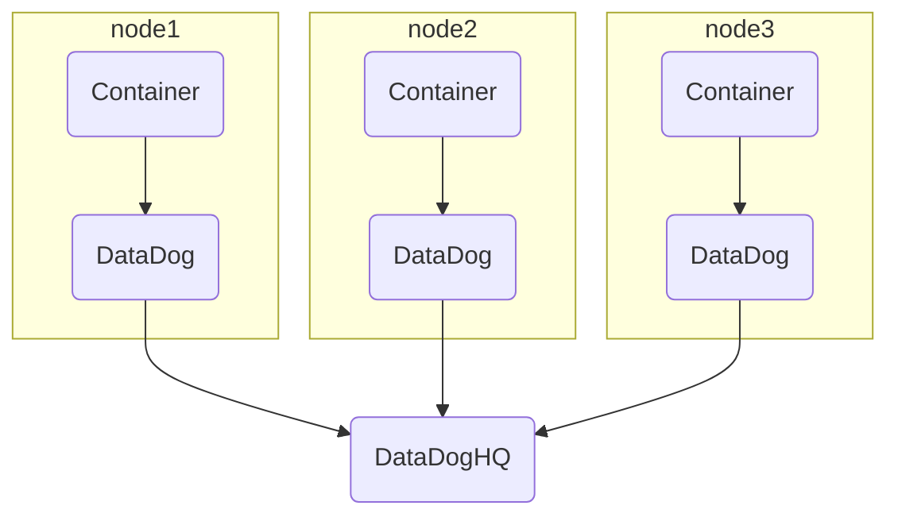
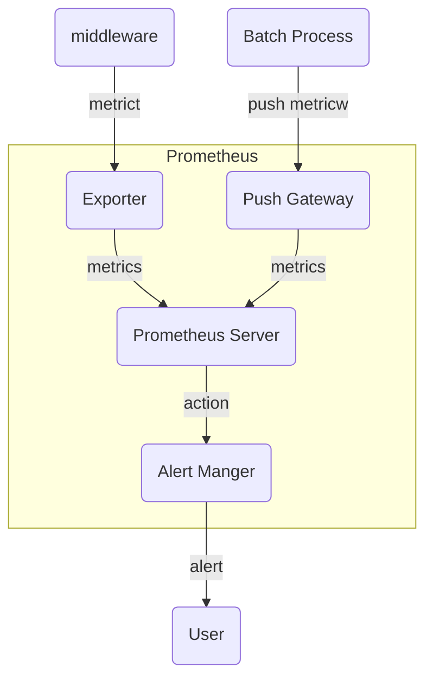

# Monitoring

## DataDog

DataDog provide metrics/visualization/monitoring.

### DataDog Archtecture

deploy DataDog Agent to each nodes with using DaemonSet.



kube-state-metrics plugin recommended.

### install

ex) datadog_values.yaml

```yaml
datadog:
  # DataDog SaaS server certificates
  apiKey: xx
  appKey: xx
  tags: "project:sample,env:dev"
  clusterAgent:
    enabled: true
    metricsProvider:
      enabled: true
  processAgent:
    enabled: true
    processCollection: true
  collectEvents: true
  loadElection: true
```

```shell
helm install sample-datadog \
  --version 2.3.0 \
  -f datadog_values.yaml
```

### DataDog Metrics

| metrics key | description |
| :----- | :----- |
| `docker.*` | for docker container |
| `kubernetes.*` | for k8s |
| `kubernetes_state.*` | for k8s ccluster level |

### watch container and alert

+ Anomary Monitoring
  + compare with past trends
+ Forecast Monitoring
  + forecast trends in metrics
+ Outlier Monitoring
  + detect differ action in specify group

## Prometheus

Promethous is observation OpenSource tool provided by CNCF.

### Prometheus Archtecture

| Actor | desctiption |
| :----- | :----- |
| Prometheus Server | collection metrics and saving |
| Alert Manager | provide alert notification |
| Expoter | provide middleware metrics to prometheus server |
| Push Gateway | provide batch metrics to prometheus server |



### install Prometheus

```shell
git clone git@github.com:coreos/kube-prometheus.git -b v0.5.0
kubectl apply -f kube-prometheus/manifests/setup/
kubectl apply -f kube-prometheus/manifests/
```

port forward setting

```shell
# for Graphana
kubectl -n monitoring port-forward service/grafana 3000
# for Prometheus Server
kubectl -n monitoring port-forward service/prometheus-k8s 9090
# for AlermManager
kubectl -n monitoring port-forward service/alertmanager-main 9093
```
