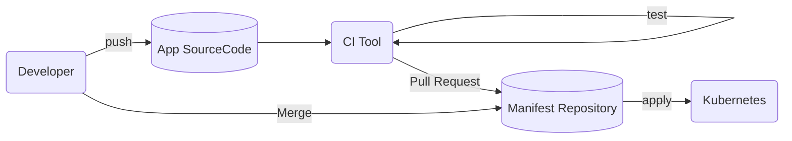

# CI/CD

## CI tool using GitOps



CI Tool: Tekton + Kaniko

## manifest check when CI

+ Kubeval
  + check manifest file format
  + datatype check
  + one binary
+ Conftest
  + privileged container
  + label lost
  + use latest image tag
  + resource setting lost
+ OpenPolicyAgent/Gatekeeper
  + Admission Controller

### kubeval

```shell
kubeval --version
kubeval ./*.yaml --kubernetes-version 1.18.1
```

### Conftest

ex) policy/sample.rego

```rego
package main

deny[msg] {
    input.kind == "Deployment"
    not (input.spec.selector.matchLabels.app == input.spec.template.metadata.labels.app)
    msg = sprintf("need same value a Pod Template and selector.: %s", [input.metadata.name])
}
```

```shell
conftest --version
conftest test ./*.yaml
```

### OpenPolicyAgent/Gatekeeper

```shell
# install Gatekeeper
kubectl apply -f https://raw.githubcontent.com/open-policy-agent/gatekeeper/v3.1.0-beta.9/deploy/gatekeeper.yaml
```

need specify label for specify resource

ex) requiredlabels/template.yaml

```yaml
apiVersion: templates.gatekeeper.sh/v1beta1
kind: ConstraintTemplate
metadata:
  name: k8srequiredlabels
spec:
  crd:
    spec:
      names: 
        kind: k8sRequiredLabels
      validation:
        openAPIV3Schema:
          properties:
            message:
              type: string
            labels:
              type: array
              items:
                type: object
                properties:
                  key: 
                    type: string
                  allowedRegex:
                    type: string
  targets:
  - target: admission.k8s.gatekeeper.sh
    rego: |-
      package k8srequiredlabels
      get_message(parameters, _default) = msg {
        not parameters.message
        msg := _default
      }
      get_message(parameters, _default) = msg {
        msg := parameters.message
      }
      violation[{"msg": msg, "details": {"missing_labels": missing}}] {
        provided := {label | input.review.object.metadata.labels[label]}
        required := {label | label := input.parameters.labels[_].key}
        missing := required - provided
        count(missing) > 0
        def_msg := sprintf("you must provide labels: %v", [missing])
        msg := get_message(input.parameters, def_msg)
      }
      violation[{"msg": msg}] {
        value := input.review.object.metadata.labels[key]
        expected := input.parameters.labels[_]
        expected.key == key
        expected.allowRegex != ""
        not re_match(expected.allowRegex, value)
          def_msg := sprintf("label <%v, %v> does not satisfy allowd regex: %v", [key, value, expected.allowRegex])
          msg := get_message(input.parameters, def_msg)
      }
```

need app label for Pod resource

ex) requiredlabels/constraint.yaml

```yaml
apiVersion: constraints.gatekeeper.sh/v1beta1
kind: K8sRequiredLabels
metadata:
  name: pod-has-app-label
spec:
  match:
    kinds:
    - apiGroups: [""]
      kinds: ["Pod"]
  parameters:
    message: "All namespace must have an `app` label"
    labels:
    - key: app
      allowRegex: "^[a-zA-Z]+$"
```

```shell
kubectl apply -f requiredlabels/template.yaml
kubectl apply -f requiredlabels/constraint.yaml
kubectl apply -f requiredlabels/example.yaml
kubectl get k8srequiredlabels pod-has-ap-label -o yaml
```

Service resource duplication check

ex) uniqueserviceselector/template.yaml

```yaml
apiVersion: templates.gatekeeper.sh/v1beta1
kind: ConstraintTemplate
metadata:
  name: k8suniqueserviceselector
spec:
  crd:
    spec:
      names:
        kind: K8sUniqueServiceSelector
  targets:
  - target: admission.k8s.gatekeeper.sh
    rego: |-
      package k8suniqueserviceselector
      make_apiversion(kind) = apiVersion {
          g := kind.group
          v := kind.version
          g != ""
          apiVersion = sprintf("%v/%v", [g, v])
      }
      make_apiversion(kind) = apiVersion {
          kind.group == ""
          apiVersion = kind.version
      }
      identical(obj, review) {
        obj.metadata.namespace == review.namespace
        obj.metadata.name == review.name
        obj.kind == review.kind.kind
        obj.apiVersion == make_apiversion(review.kind)
      }
      flatten_selector(obj) = flattened {
        selectors := [s | s = concat(":", [key, val]); val = obj.spec.selector[key]]
        flattened := concat(",", sort(selectors))
      }
      violation[{"msg": msg}] {
        input.review.kind.kind == "Service"
        input.review.kind.version == "v1"
        input.review.kind.group == ""
        input_selector := flatten_selector(input.review.object)
        other := data.inventry.namespace[namespace][_][_][name]
          not identical(other, input.review)
          other_selector := flatten_selector(other)
          input_selector == other_selector
          msg := sprintf("same selector as service <%v> in namespace <%v>", [name, namespace])
      }
```

ex) uniqueserviceselector/sync-service.yaml

```yaml
apiVersion: config.gatekeeper.sh/v1beta1
kind: Config
metadata:
  name: config
  namespace: gaetkeeper-system
spec:
  sync:
    syncOnly:
    - group: ""
      version: v1
      kind: Service
```

```shell
kubectl apply -f uniqueserviceselector/template.yaml
kubectl apply -f uniqueserviceselector/constraint.yaml
kubectl apply -f uniqueserviceselector/sync-service.yaml
kubectl apply -f uniqueserviceselector/example1.yaml
kubectl apply -f uniqueserviceselector/example2.yaml
kubectl delete constrainttemplates --all
```

## CD Tool using GitOps

check repository and deploy to cluster.use ArgoCD.

### ArgoCD

installation

```shell
kubectl create namespace argocd
kubectl apply -n argocd  -f https://raw.githubusercontent.com/argoproj/argo-cd/v1.5.5/manifests/install.yaml
```

manifest of git repository sync to cluster

ex) sample-cd.yaml

```yaml
apiVersion: argoproj.io/v1beta1
kind: Application
metadata:
  name: sample-cd
  namespace: argocd
spec:
  project: default
  source:
    repoURL: https://github.com/MasayaAomiya/kubernetes-perfect-quide.git
    targetRevision: 2nd-edition
    path: sample/chapter17/argocd/manifests
    directory:
      recurse: true
  destination:
    server: https://kubernetes.default.svc
    namespace: default
  syncPolicy:
    automated:
      prune: true
      selfHeal: true
```

```shell
kubectl -n default get deployments,services
kubectl -n argocd describe
```

use ArgoCD WebUI

```shell
kubectl -n argocd port-forward service/argocd-server 8080:80
# check admin password
kubectl -n argocd get pod -l app.kubernetes.io/name=argocd-server -o jsonpath=".items[].metadata.name}"
```

## for developer tool

+ [Telepresence](https://www.telepresence.io/)
  + remote k8s cluster use
  + Sandbox project of CNCF
+ [Skaffold](https://github.com/GoogleContainerTools/skaffold)
  + build and deploy automation for Docker and k8s

### Telepresence

installation

```shell
brew cask install osxfuse
brew install datawire/blackbird/telepresence
```

create Deployment and Service

```shell
kubectl apply -f sample-deployment.yaml
kubectl apply -f sample-clusterip.yaml
kubectl apply -f replace-deployment.yaml
kubectl get pods
```

local execute

```shell
telepresence \
  --swap-deployment replace-deployment \
  --docker-run --rm -it amsy810/tools:v2.0
```

check replace image

```shell
podid=`kubectl get pods | tail -n 1 | awk '{print $1}'`
kubectl get pod ${podid} -o jsonpath="{.spec.containers[].image}"
```

local container check

```shell
containerid=`docker ps | grep amy810 | awk '{print $1}'`
docker exec -it ${containerid} curl sample-clusterip.default.svc.cluster.local:8080
```

### Skaffold

Skaffold provide image build, image push and k8s deploy.

installation

```shell
brew install skaffold
# for linux
curl -L https://storage.googleapis.com/skaffold/release/latest/skaffold-linux-amd64 -o skaffold
chmod +x skaffold
sudo mv ./skaffold /usr/local/bin/
skaffold version
```

need

+ application source
+ Dockerfile
+ k8s manifest

ex) scaffold/main.go

```go
package main

import (
  "fmt"
  "net/http"
)

func handler(w http.ResponseWriter, r *http.Request) {
  fmt.Fprintf(w, "Http Skaffold")
}

func main() {
  http.HandlerFunc("/", handler)
  http.ListenAndServe(":8080", nil)
}
```

ex) Dockerfile

```Dockerfile
FROM golang:1.14.1-alpha3.11 as builder
COPY ./main.go ./
RUN go build -o /go-app ./main.go

FROM alpine:3.11
EXPOSE 8080
COPY --from=builder /go-app .
ENTRYPOINT ["./go-app"]
```

ex) skaffold/skaffold-deployment.yaml

```yaml
apiVersion: v1
kind: Deployment
metadata:
  name: skaffold-deployment
spec:
  replicas: 2
  selector:
    matchLabels:
      app: sample-skaffold
  template:
    metadata:
      labels:
        app: sample-skaffold
    spec:
      containers:
        - name: nginx-container
          image: DOCKERHUB_USER/sample-skaffold
```

ex) skaffold/skaffold-service.yaml

```yaml
apiVersion: v1
kind: Service
metadata:
  name: scaffold-service
spec:
  type: LoadBalancer
  ports:
    - name: "http-port"
      protocol: "TCP"
      port: 80
      targetPort: 8080
    selector:
      app: sample-scaffold
```

docker login

```shell
docker login
```

use scaffold

ex) scaffold/scaffold.yaml

```yaml
apiVersion: skaffold/v2alpha3
kind: Config
build:
  artifacts:
  - image: DOUCKERHUB_USER/sample-scaffold
    docker:
      dockerfile: ./Dockerfile
  tagPolicy:
    dateTime: {}
  local:
    # when push unnecessary.behavior is build and k8s deploy.
    # push: false
    push: true
deploy:
  kubectl:
    manifests:
    - scaffold-*
```

build section

+ build environment
  + default local build.
  + Google Cloud Build
  + Kaniko
+ build tool
  + Default: Docker
  + Jib
  + Bazel
  + Cloud Native Buildpacks

deploy section is deploy approach information.relatable to Helm, Kustomize.

```shell
skaffold dev
kubectl get deployment skafold-deployment -o jsonpath="{.spec.template.spec.containers[].image}"
LB_IP=$(kubectl get service skaffold-service -o jsonpath="{.status.loadBalancer.ingress[0].ip}")
curl http://${LB_IP}
```

application update

```shell
sed -i -e 's/Http Skaffold/Hello Skaffold/g' main.go
skaffold dev
kubectl get deployment skafold-deployment -o jsonpath="{.spec.template.spec.containers[].image}"
LB_IP=$(kubectl get service skaffold-service -o jsonpath="{.status.loadBalancer.ingress[0].ip}")
curl http://${LB_IP}
```

push registory when prod environment only

ex) skaffold/profiles-skaffold.yaml

```yaml
apiVersion: skaffold/v2alpha3
kind: Config
build:
  artifacts:
  - image: DOCKERHUB_USER/sample-skaffold
    docker:
      dockerfile: ./Dockerfile
  tagPolicy:
    dateTime: {}
profiles:
- name: prdProfile
  build:
    local:
      push: true
  deploy:
    kubeContext: gke_PROJECT_asia_northeast1-a_k8s
    kubectl:
      manifests:
      - scaffold-*
- name: devProfile
  build:
    local:
      push: false
  deploy:
    kubeContext: docker-desktop
    kubectl:
      manifests:
      - dev-scaffold-*
```

```shell
skaffold dev -f profiles-skaffold.yaml --profile prdProfile
skaffold dev -f profiles-skaffold.yaml --profile devProfile
```

onshot pipeline(for in shell)

```shell
skaffold run
skaffold run -f profile-skaffold.yaml --profile prdProfile
```
