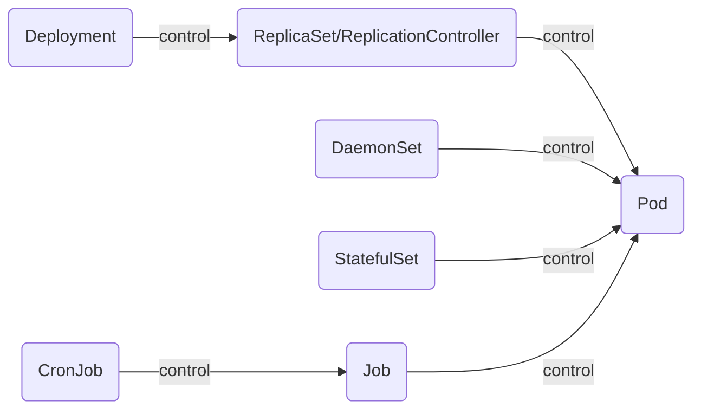
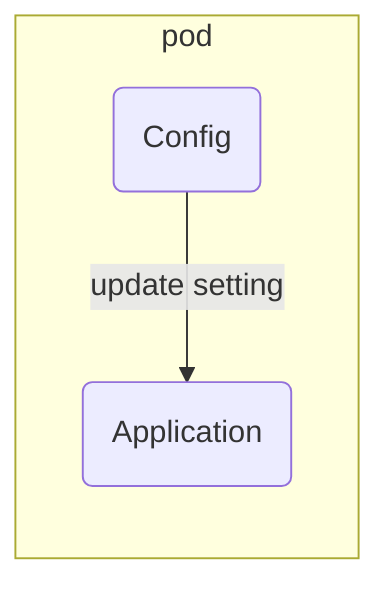
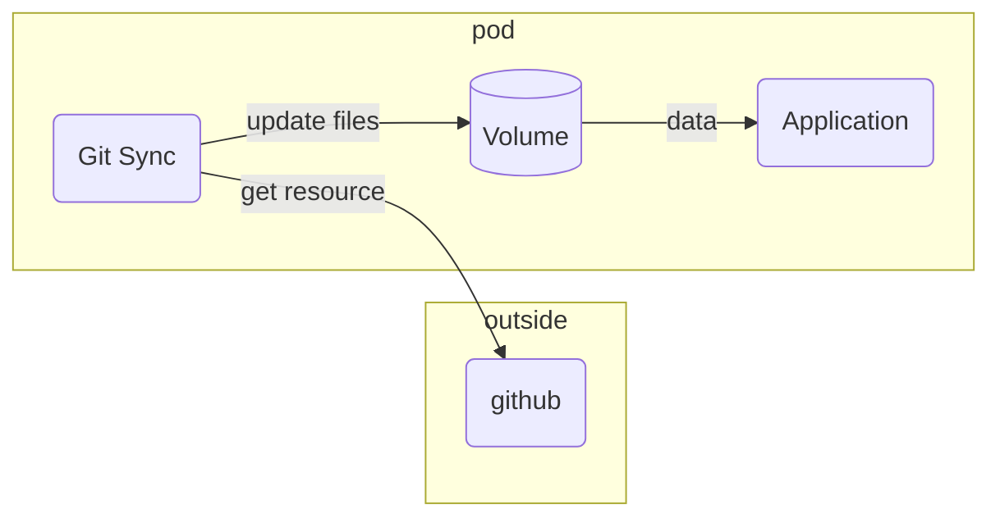
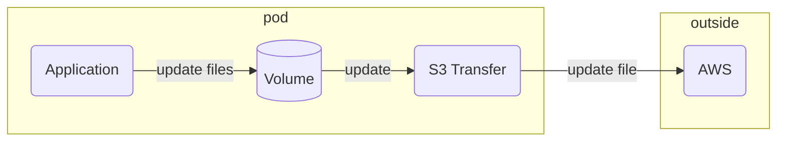
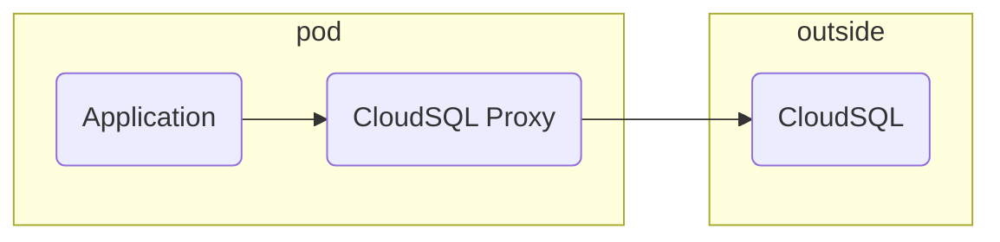
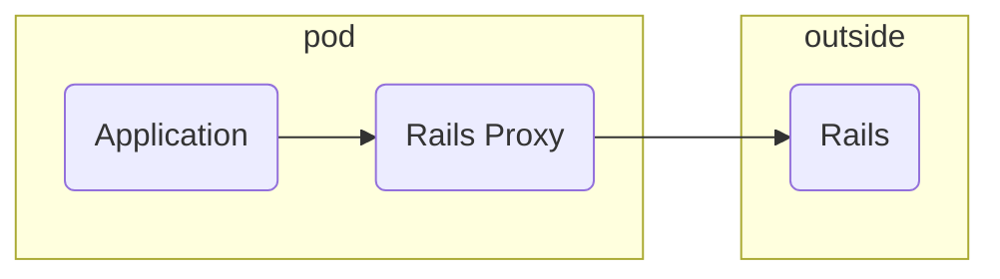
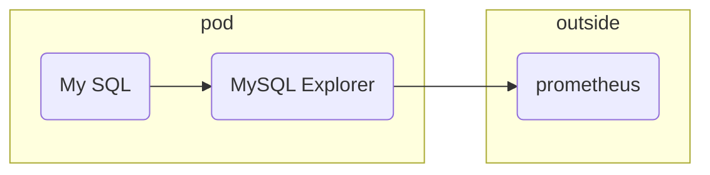
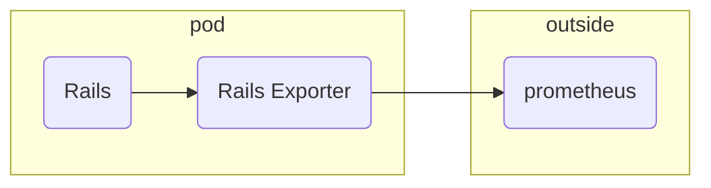
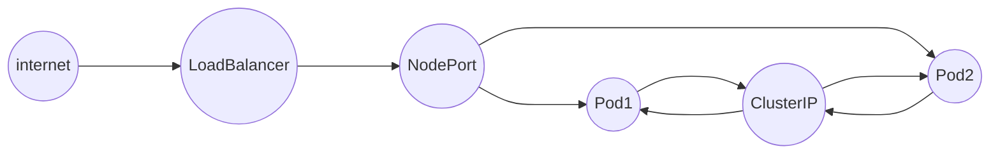
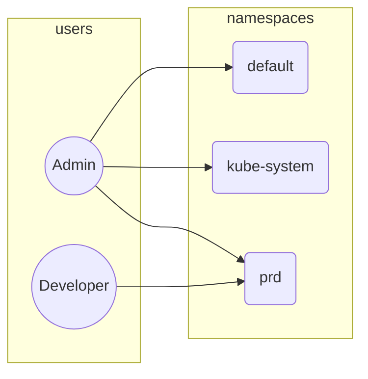

# outline

component

+ Control Planes(Admin or Master)
  + etcd: database
  + kube-api server: k8s api
  + kube-controller manager: k8s control.ex, startup pod.
  + cloud controller manager: AWS/GCP accessor
  + kube-scheduler: assign pod to worker
+ Nodes(Worker)
  + kube-proxy: node network ruler
  + kubelet: k8s agent
  + container runtime: docker, containerd, cri-o, etc.

# resource



overwarp computer resource.

| k8s | computer |
| :----- | :-----|
| service | iptables |
| pod | container |

+ node: worker node.see components Nodes.
+ pod: containers for containers.
+ replicaset: pod replica.using for auto restart.
+ deployment: function of deploy management using any ReplicaSet.rollback, rolling update.
+ service: pod endpoint management resource.loadbalancing.

## workload

workload is an application running on kubernetes.

have a `deployment`, `replicaset`

## deployments

```shell
kubectl create deployment hello-node --image=k8s.gcr.io/echoserver:1.4
kubectl get deployments
```

```shell
kubectl expose deployment hello-node --type=LoadBalancer --port=8080
```

```shell
kubectl delete deployment hello-node
```

## pods

pod is a running container set.have a lifecycle, ip address, volumes and container infomations.
ip address and port is shared in same pod.recomended one pod one container.

lifecycle

+ pending
+ running
+ succeeded
+ failed
+ unknown

```shell
kubectl get pots
```

designpattern

| pattern | description |
| :----- | :----- |
| sidecar | add function to main container.main container plus alpha. |
| ambasador | communication outside system |
| adapter | surface for outside system |

sidecar







ambassador





adapter





## events

```shell
kubectl get events
```

## config

```shell
kubectl config view
```

## services

control pod network endpoint.loadbalancing.have a any type.

type

+ ClusterIP: ip address for k8s local network.
+ NodePort: ip address for internet.
+ LoadBalancer: virtual ip address for internet.using aws, gcp and MetaILB.
+ etc



```shell
kubectl get services
kubectl delete service hello-node
```

## addons

```shell
minikube addons list
minikube addons enable metrics-server
```

metrics-server add to pods

```shell
kubectl get pod,svc -n kube-system
```

```shell
minikube addons disable metrics-server
```

## container

lifecycle

 + waiting
 + running
 + terminated

# APIs

+ [Workloads](./WorkloadsApi.md)
  + Pod
  + ReplicationController
  + ReplicaSet
  + Deployment
  + DaemonSet
  + StatefulSet
  + Job
  + CronJob
+ Service
  + Service
    + ClusterIP
    + ExternalIP
    + NodePort
    + LoadBalancer
    + Headless
    + ExternalName
    + None-Selector
  + Ingress
+ Config and Storage
  + Secret
  + ConfigMap
  + PersistentVolumeClain
+ Cluster
  + Node
  + Namespace
  + PersistentVolume
  + ResourceQuota
  + ServiceAccount
  + Role
  + ClusterRole
  + RoleBinding
  + ClusterRoleBinding
  + NetworkPolicy
+ Metadata
  + LimitRange
  + HorizontalPodAutoscaler
  + PodDistoributionBudget
  + CustomResourceDefinition

# namespace

| namespace | description |
| :----- | :----- |
| kube-system | cluster component and addon |
| kube-public | config map and others |
| kube-node-lease | node haeat beat information |
| default | default namespace |



# kubectl

kubectl is tool calling kubernetes api.need kubeconfig(`~/.kube/config`).

ex) config

```yaml
apiVersion: v1
kind: Config
preferences: {}
clusters:
- name: simple-cluster
  cluster: 
    server: http://localhost:6443
users:
- name: simple-user
  user:
    client-certificate-data: ...
    client-key-data: ...
contexts:
- name: simple-context
  context:
    cluster: simple-cluster
    namespace: default
    user: simple-user
current-context: simple-context
```

add cluster setting

```shell
kubectl config set-cluster prd-cluster \
  --server: https://localhost:6443
```

add certificate

```shell
kubectl config set-credenticals admin-user \
  --client-certificate=./simple.crt \
  --client-key=./simple.key \
  --embed-certs=true
```

add context

```shell
kubectl config set-context pre-admin \
  --cluster=prd-cluster \
  --user=admin-user \
  --namespace=default
```

context operation

```shell
# show context
kubectl config get-context
# change context
kubectl config use-context prd-admin
# show current context
kubectl config current-context
```

any tools

+ kubectx
+ kubens

## manifest and resource

manifest example(sample-pod.yaml)

```yaml
appVersion: v1
kind: Pod
metadata:
  name: sample-pod
spec: 
  containers:
  - name: nginx-container
    image: nginx:1.16
```

create pod.

```shell
kubectl create -f sample-pod.ysml
# apply command more useful
kubectl apply -f sample-pod.yaml
```

check created pod

```shell
kubectl get pods
# specific pod
kubectl get pod sample-pod -o yaml
kubectl get pod sample-pod -o json
```

delete pod

```shell
kubectl delete -f sample-pod.yaml
# specific name
kubectl delete pod sample-pod
# all pods
kubectl delete pod --all
# wait sync
kubectl delete -f sample-pod.yaml --wait
# release resource asap
kubectl delete -f sample-pod.yaml --grace-period 0 --force
```

resource update

```shell
kubectl create -f sample-pod.yaml
# sample-pod.yaml image version chgange 1.16 -> 1.17
kubectl apply -f sample-pod.yaml
```

server side apply.

```shell
kubectl apply -f sample-pod.yaml --server-side
kubectl set image pod sample-pod nginx-container=nginx:1.17
# sample-pod.yaml image version chgange 1.16 -> 1.17
kubectl apply -f sample-pod.yaml --server-side
kubectl apply -f sample-pod.yaml --server-side --force-conflicts
# specified manager 
kubectl apply -f sample-pod.yaml --server-side --force-conflicts --field-manager ci-tool
```

check pod information

```shell
kubectl get pod sample-pod -o yaml
kubectl get pod sample-pod -o jsonpath="{.spec.containers[?(@.name == 'nginx-container')].image}"
kubectl get pod sample-pod -o jsonpath="{.metadata.manageFields}" | jq '.'
```

pod restart.create `sample-deployment.yaml`.

```yaml
apiVersion: apps/v1
kind: Deployment
metadata:
  name: sample-deployment
  labels:
    app: nginx
spec:
  replicas: 3
  selector:
    matchLabels:
      app: nginx
  template:
    metadata:
      labels:
        app: nginx
    spec:
      containers:
      - name: nginx
        image: nginx:1.14.2
        ports:
        - containerPort: 80
```

```shell
kubectl apply -f sample-deployment.yaml
kubectl apply -f sample-pod.yaml
kubectl rollout restart deployment sample-deployment
```

randomaized name resource(use kubectl create command)

ex) sample-generatename.yaml

```yaml
apiVersion: v1
kind: Pod
metadata:
  generateName: sample-generatename-
spec:
  containers:
  - name: nginx-container
    image: nginx:1.16
```

wait kubectl command

```shell
kubectl create -f sample-pod.yaml
kubectl create -f sample-generatename.yaml
kubectl create -f sample-generatename.yaml
kubectl wait --for=condition=Ready
kubectl wait --for=condition=PodScheduled pod --all
kubectl wait --for=delete pod --all --timeout=5s
kubectl wait --for=delete pod --all
kubectl delete pod -all --wait=false
```

## manifest file

multi resource(sample-multi-resource-manifest.yaml)

```yaml
---
apiVersion: apps/v1
kind: Deployment
metadata:
  name: order1-deployment
spec:
  replicas: 3
  selector:
    matchLabels:
      app: sample-app
  template:
    metadata: 
      labels: 
        app: sample-app
    spec:
      containers:
      - name: nginx-container
        image: nginx:1.16
---
apiVersion: v1
kind: Service
metadata:
  name: order2-service
spec:
  type: LoadBalancer
  ports:
  - name: "http-port"
    protocol: "TCP"
    port: 8080
    targetPort: 80
  selector:
    app: sample-app
```

create resource

```shell
kubectl apply -f sample-multi-resource-manifext.yaml
# multi files
kubectl apply -f ./dir
# multi files recursive
kubectl apply -f ./dir -R
```

## annotation and label

`[@prefix]/key: value` format.

| item | desccription |
| :----- | :----- |
| annotation | metadata.annotations.using system component |
| label | metadata.labels.for developer or system(ex: Rancher) |

annotaion yaml(sample-annotation.yaml)

```yaml
apiVersion: v1
kind: Pod
metadata:
  name: sample-annotation
  annotations:
    annotation1: val1
    annotation2: "200"
...
```

add or remove from shell

```shell
sudo kubectl annotate pod sample-annotations annotation3=val13
sudo kubectl annotate pod sample-annotations annotation3=val13-new --overwrite
sudo kubectl get pod sample-annotations -o json
sudo kubectl get pod sample-annotations -o jsonpath="{.metadata.annotations}" | jq '.'
sudo kubectl annotate pod sample-annotations annotation3-
sudo kubectl get pod sample-annotations -o jsonpath="{.metadata.annotations}" | jq '.'
```

label(sample-label.yaml)

```yaml
apiVersion: v1
kind: Pod
metadata:
  name: sample-label
  labels:
    label1: val1
    label2: val2
spec:
  containers:
    - name: nginx-container
      image: nginx:1.16
```

```shell
sudo kubectl apply -f sample-label.yaml
sudo kubectl get pod sample-label -o jsonpath="{.metadata.labels}" | jq '.'
sudo kubectl label pods sample-label label3=val3
sudo kubectl label pods sample-label label3=val3-new --overwrite
sudo kubectl label pods sample-label label3-
```

filtering

```shell
sudo kubectl get pods -l label1
sudo kubectl get pods -l label1=val1
sudo kubectl get pods -l label1,label2
sudo kubectl get pods -L label1 -l label1
sudo kubectl get pods --show-labels
```

label name rule

| key name | description |
| :----- | :----- |
| app.kubernetes.io/name | application name |
| app.kubernetes.io/version | application version |
| app.kubernetes.io/component | application role |
| app.kubernetes.io/part-of | system name |
| app.kubernetes.io/instance | system identification instance name |
| app.kubernetes.io/managed-by | application control tool |

## prune option

prune-sample/sample-pod1.yaml

```yaml
apiVersion: v1
kind: Pod
metadata:
  name: sample-pod1
  labels:
    system: a
spec:
  containers:
    - name: nginx-container
      image: nginx:1.16
```

prune-sample/sample-pod2.yaml

```yaml
apiVersion: v1
kind: Pod
metadata:
  name: sample-pod2
  labels:
    system: a
spec:
  containers:
    - name: nginx-container
      image: nginx:1.16
```

```shell
sudo kubectl apply -f ./prune-sample --prune -l system=a
rm ./prune-sample/sample-pod1.yaml
sudo kubectl apply -f ./prune-sample --prune -l system=a
```

```text
pod/sample-pod1 unchanged
pod/sample-pod2 unchanged
error: error retrieving RESTMappings to prune: invalid resource batch/v1, Kind=CronJob, Namespaced=true: no matches for kind "CronJob" in version "batch/v1"
```

## edit

```shell
export EDITOR=vim
kubectl edit pod sample-pod
```

can set resource without update manifest

+ env
+ image
+ resources
+ selector
+ serviceaccount
+ subject

```shell
sudo kubectl describe pod sample-pod
sudo kubectl set image pod sample-pod nginx-container=nginx:1.17
sudo kubectl describe pod sample-pod
sudo kubectl diff -f sample-pod.yaml
```

## resources

api resources

```shell
sudo kubectl api-resources
sudo kubectl api-resoruces --namespaced=true
sudo kubectl api-resoruces --namespaced=false
```

get pod resources

```shell
sudo kubectl get pods
sudo kubectl get pod sample-pod
# sudo kubectl label pod sample-pod label1=val1
sudo kubectl get pods -L label1 -l label1
sudo kubectl get pods --show-labels
# -o option
#  -o, --output='': Output format. One of:
#json|yaml|name|go-template|go-template-file|template|templatefile|jsonpath|jsonpath-as-json|jsonpath-file|custom-columns-file|custom-columns|wide
sudo kubectl get pod sample-pod -o wide
sudo kubectl get pod sample-pod -o yaml
sudo kubectl get pod sample-pod -o custom-columns="NAME:{.metadata.name},NodeIP:{.status.hostIP}"
sudo kubectl get pod sample-pod -o jsonpath="{.metadata.name}"
sudo kubectl get pods -o go-template="{{range .items}}{{.metadata.name}}: {{range .spec.containers}}{{.image}}{{end}}{{end}}"
```

other resources

```shell
sudo kubectl get nodes
sduo kubectl get all
# all resource
sudo kubectl get $(sudo kubectl api-resources --namespaced=true --verbs=list -o name | tr '\n' ',' | sed -e 's/,$//g')
```

watchdog

```shell
sudo kubectl get pods --watch
sudo kubectl get pods --watch --output-watch-events
```

description

```shell
sudo kubectl describe pod sample-pod 
sudo kubectl describe node kindcluster-worker
```

use resource.'kubectl top` command need enabling a Metrics API.check GKE environment.

```shell
sudo kubectl top node
sudo kubectl top pods
sudo kubectl -n kube-system top pod
sudo kubectl -n kube-system get pods
sudo kubectl -n kube-system get pod --containers
```

## debug container

execute command

```yaml
apiVersion: v1
kind: Pod
metadata:
  name: sample-pod
spec: 
  containers:
  - name: nginx-container
    image: nginx:1.16
  - name: nginx-miyata
    image: nginx:1.16
  - name: nginx-saitou
    image: nginx:1.16
```

```shell
sudo kubectl exec -it sample-pod -- /bin/ls
sudo kubectl exec -it sample-pod -c nginx-miyata -- /bin/ls
```

unknown error specific container.try GKE.

```text
sudo kubectl exec -it sample-pod -c nginx-miyata  -- /bin/ls
error: unable to upgrade connection: container not found ("nginx-miyata")
sudo kubectl exec -it sample-pod -c yutaka  -- /bin/ls
Error from server (BadRequest): container yutaka is not valid for pod sample-pod
```

```shell
sudo kubectl exec -it sample-pod -- /bin/bash
# exit
sudo kubectl exec -it sample-pod -c nginx-container -- /bin/bash -c "whoami | sed 's/root/miyata/g'"
```

create debug container.try GKE.

```shell
sudo kubectl debug sample-pod --image=amsy810/tools:v2.0 -it -- bash
# Defaulting debug container name to debugger-5lwt5.
# error: ephemeral containers are disabled for this cluster (error from server: "the server could not find the requested resource").
sudo kubectl debug sample-pod --image=amsy810/tools:v2.0 --container debug-container
sudo kubectl exec -it sample-pod -c debug-container -- bash
```

logging

```shell
sudo kubectl logs sample-pod
sudo kubectl logs sample-pod -c nginx-container
sudo kubectl logs sample-pod -c nginx-container -f
sudo kubectl logs --since=10h --tail=10 --timestamps=true sample-pod -c nginx-container
sudo kubectl logs --selector label=val1
```

kubectl command network data

```shell
sudo kubectl -v=6 get pods
sudo kubectl -v=8 get pods
```

## local machine to pod

port forwarding

```shell
sudo kubectl port-forward sample-pod 8888:80
sudo kubectl port-forward deployment/sample-deployment 8888:80
sudo kubectl port-forward service/sample-service 8888:80
# redirect sample-pod:80 or deployment, servicee
curl -L localhost:8888
```

file copy 

```shell
sudo kubectl cp sample-pod:/etc/hostname ./hostname
sudo kubectl cp ./hostname sample-pod:/etc/hostname 
```

## extended subcommand

install [krew](https://krew.sigs.k8s.io/docs/user-guide/setup/install/)

```shell
sudo kubectl plugin list
sudo kubectl krew install tree rolesum sort-manifests open-svc view-serviceaccount-kubeconfig
```
